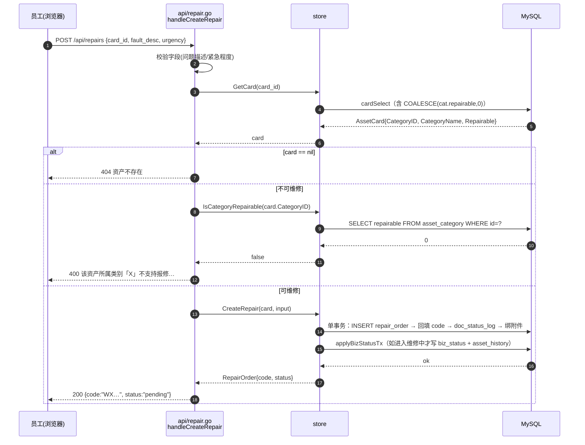
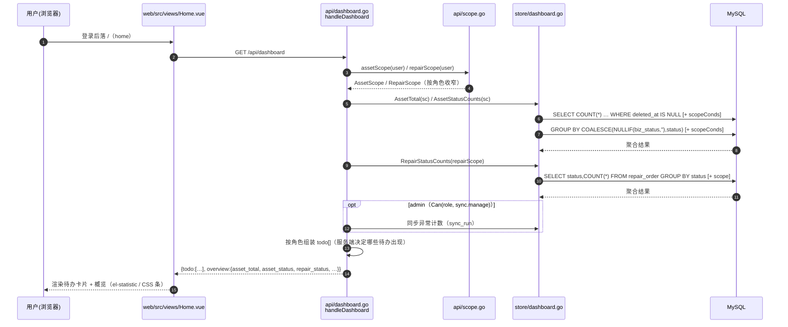
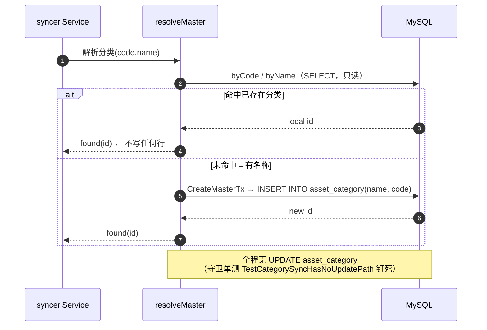
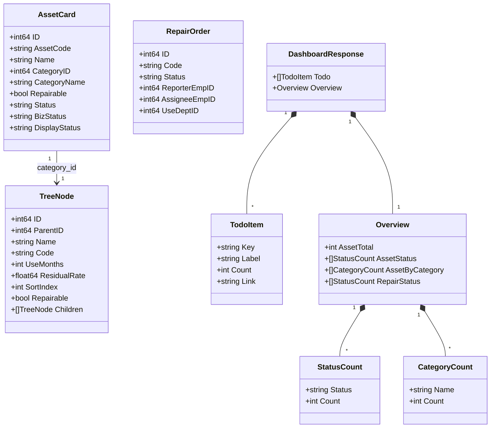

# FAMS 增量架构设计：分类「可维修」标签 + 首页

| 项 | 内容 |
|---|---|
| 项目 | FAMS · 固定资产台账管理系统（广东某电器集团，**生产在跑**） |
| 文档 | 增量架构设计（基于已上线的维修模块 P0，commit `f4403f9`） |
| 版本 | v1.0 |
| 编写 | 高见远 · 架构师 |
| 上游依据 | `docs/增量需求-可维修标签与首页.md`（产品）、`docs/设计宗旨.md`（19 条清单 + 8 条反例）、`docs/维修流程模块架构建议.md`（§1.4 同步契约、§1.5 `display_status`） |
| 语言 | 简体中文 |

---

## 0. 结论速览（TL;DR）

| # | 决策点 | 结论 | 一句话理由 |
|---|---|---|---|
| **A-1** | 标签载体 | `asset_category.repairable TINYINT(1) NOT NULL DEFAULT 0`（**本地列**） | 分类是本地主数据，同步对它**只有 INSERT、没有 UPDATE**（证据链见 §1.1）→ 加列**零同步风险**，与 `asset_card.status` 性质完全不同 |
| **A-2** | 判定位置 | **后端单点**（`api/repair.go` 在 `GetCard` 与 `CreateRepair` 之间） | 前端隐藏是体验，后端 400 是底线；只有一份规则（原则 3） |
| **A-3** | 迁移方式 | 用既有 `addColumnIfMissingBackfill`，backfill 只跑一次 | 天然幂等；不写「每次启动都 UPDATE」，避免将来把空值行悄悄改成另一个资源 |
| **A-4** | 默认值取向 | `DEFAULT 0`（不可维修） | 拦一单可恢复，放一单污染数据；宁可少开 |
| **B-1** | 首页形态 | **一个页面 + 按角色渲染区块**（`Home.vue`），不按角色分页 | 路由唯一（`/`→`home`），差异本质是「看多少行」，可见范围已由服务端 scope 收窄 |
| **B-2** | 统计口径 | 一律 `display_status = COALESCE(NULLIF(biz_status,''), status)` | 裸 `status` 每日 00:00 被同步重置，维修中永远算不出来（反例 #7） |
| **B-3** | 性能 | **P0 不做缓存**，DB 侧 `GROUP BY` 聚合 | 全库约 227 行，全表聚合亚毫秒级；加缓存反而引入第二份真相（违反原则 4） |
| **B-4** | 权限 | **复用** `api/scope.go` 的 `assetScope` / `repairScope`，抽出 `scopeConds` 供列表与首页**共用** | 避免两处 WHERE 分叉；两套 scope 的 SQL 只写一次 |
| **B-5** | 图表库 | **不引入** | 227 行 + 少量指标，`el-statistic` + CSS 条即可；引入 echarts 违反 §B.5 不做清单 |

**阻塞项**：需求 A/B 均**无技术阻塞**。老板已拍板 4 项（运输工具默认可维修 / 其他默认不可维修 / 不可维修隐藏按钮 / 登录落首页），已按此设计。产品文档 §四 的 Q4、Q6–Q10 属**范围取舍**（非架构问题），列于 §7 供产品确认，**不改需求**。

---

## 1. 需求 A：分类「可维修」标签

### 1.1 证据链：`asset_category` 没有 UPDATE 路径（加列安全的**全部**依据）

**这是本需求能否成立的地基。** 必须先证明「同步不会 UPDATE 分类行」，否则 `repairable` 会像当年的 `status` 一样被每日同步抹掉。

#### 1.1.1 全库所有写 `asset_category` 的语句（穷举）

用 `grep "asset_category"` 扫全仓（含 `syncer/`），所有**写**语句只有 4 条：

| # | 文件:行 | 语句 | 谁调用 | 语义 |
|---|---|---|---|---|
| 1 | `store/sync.go:110` | `INSERT INTO asset_category (name, code) VALUES (?, ?)` | `CreateMasterTx`，被 `syncer/syncer.go:497`（真实同步）与 `store/orgsync.go:95`（组织同步）调用 | **同步路径唯一写入口：只 INSERT 新分类** |
| 2 | `store/masterdata.go:72` | `INSERT INTO asset_category (name, code, parent_id, use_months, residual_rate, sort_index) VALUES (...)` | `SaveCategory`（`ID==0`） | 本地管理员新增分类 |
| 3 | `store/masterdata.go:79` | `UPDATE asset_category SET name=?, code=?, ... WHERE id=?` | `SaveCategory`（`ID!=0`） | **本地管理员**编辑分类（**不是同步**） |
| 4 | `store/seed.go:14` | `INSERT INTO asset_category (...) VALUES (7 条种子)` | `Seed` → `seedIfEmpty` | **仅当表为空**时写种子（生产非空，永不执行） |

读语句：`masterdata.go:11`（`ListCategories`）、`masterdata.go:322/334`（Lookup）、`card.go:25`（`LEFT JOIN`）——只读，无关。

> ⚠️ **注意 #3 与 #4 的区别（决定守卫单测的范围）**：全库确实**存在**一条 `UPDATE asset_category`（`store/masterdata.go:79`），但它是**手工主数据维护路径**（管理员在分类页点保存），**合法存在、不在同步链路上**。本需求的安全前提只关乎「**同步链路**没有 UPDATE」。因此 §1.1.4 的守卫单测**只扫同步白名单**（`store/sync.go`、`store/orgsync.go`、`syncer/` 目录下所有 `.go`），**刻意排除 `store/masterdata.go`**——若误按「全库 grep 无 `UPDATE asset_category`」来写，这条测试会因 #3 直接失败。

#### 1.1.2 同步侧为什么**不可能**产生 UPDATE

同步解析分类走 `syncer/syncer.go:331-333` → `resolveMaster`（`syncer/syncer.go:470-501`），逻辑为：

1. 按**编码**查本地（`byCode`）；
2. 编码查不到，按**名称**兜底（`byName` → `LookupUniqueByName`）；
3. 两者都查不到，才 `CreateMasterTx` **INSERT 一条新分类**。

**关键点**：命中已存在的分类时，`resolveMaster` 只是**返回它的 id**（`found(id)`），**从不回写分类行**。分类不是「托管实体」——它没有 `kingdeeOwnedColumns` 那种「每次覆盖」的字段清单。同步对已存在的分类，**全程只读**。

#### 1.1.3 为什么 `asset_card.status` 当年不安全、而分类安全

| 维度 | `asset_card.status`（当年 R1 的坑） | `asset_category.repairable`（本次） |
|---|---|---|
| 是否有「托管列清单」 | **有**。`status` 在 `kingdeeOwnedColumns`（`store/sync.go:216-224`）里 | **无**。分类表根本没有托管列机制 |
| 是否有「每次覆盖」的写路径 | **有**。`mergeOwnedFields`（`store/sync.go:327-329`）`if src.Status != "" { dst.Status = src.Status }`，随后 `ApplyOwnedCardTx` 的 UPDATE（`sync.go:460-471`）把它写回库 | **无**。同步命中的分类只被读 id |
| 每日 00:00 后果 | 「维修中」被 `useStatusMap` 映射的「在用」覆盖（227/227 卡命中） | 分类行**一个字节都不动** |
| 结论 | **不安全**，故当年另开本地列 `biz_status`（方案 C） | **安全**，可直接在分类表加本地列 |

> **一句话**：`status` 不安全是因为它是「同步托管列」；`repairable` 安全是因为分类行**根本没有托管列**。两者不是同一类问题，不能因为都「加列」就一概而论。

#### 1.1.4 这个前提必须被**钉死**（守卫单测）

加列安全的前提是「同步路径里没有 `UPDATE asset_category`」。这是**改错了不会让编译失败、也不会让别的测试变红**的静默故障——正是最该守的。故新增守卫单测，参照 `store/repair_guard_test.go` 的 `TestBizStatusNotInOwnedColumnLists` 的做法（**扫源码**而非连库：连库测不到「未来新增的 UPDATE 分支」，扫源码能）。

```go
// store/category_guard_test.go
package store

import (
	"os"
	"path/filepath"
	"strings"
	"testing"
)

// syncPathFiles 返回「同步链路」的白名单文件：只有这些文件参与
// 「外部数据 → 本地分类」的写入。
//
// ⚠️ 刻意**不包含** store/masterdata.go：那里的 `UPDATE asset_category`（L79）
// 是手工主数据维护路径（管理员在分类页保存），合法存在，**不在本守卫范围内**。
// 本守卫只回答一个问题：「同步会不会 UPDATE 分类行？」——手工维护会不会，不是它的事。
func syncPathFiles(t *testing.T) []string {
	t.Helper()
	files := []string{"sync.go", "orgsync.go"} // 均在同包 store/ 下
	syncerGo, err := filepath.Glob("../syncer/*.go") // syncer/ 目录下所有 .go
	if err != nil {
		t.Fatalf("列举 syncer 目录失败：%v", err)
	}
	return append(files, syncerGo...)
}

// TestCategorySyncHasNoUpdatePath 钉死需求 A 的安全前提：
// **同步链路**对 asset_category 只有 INSERT，没有 UPDATE。
//
// 为什么必须钉死：repairable 是台账本地列，之所以敢加，唯一依据就是
// 「同步不会 UPDATE 分类行」（见 docs/增量架构-可维修标签与首页.md §1.1）。
// 一旦将来有人在同步路径里加了 `UPDATE asset_category SET ...`（比如为了同步类别名/编码），
// 本地维护的 repairable 会被静默抹掉，且不会让任何测试变红。
//
// 用扫源码而不是连库：连库只能验证「当前这条 INSERT 没 UPDATE」，
// 测不到「未来新增的 UPDATE 分支」；扫源码能覆盖到新增代码。
//
// 范围限定为同步白名单（syncPathFiles）——手工维护路径 masterdata.go 的
// UPDATE 是合法的，**不在本守卫范围内**，所以绝不能改成「全库 grep」。
func TestCategorySyncHasNoUpdatePath(t *testing.T) {
	for _, f := range syncPathFiles(t) {
		b, err := os.ReadFile(f)
		if err != nil {
			t.Fatalf("读取 %s 失败：%v", f, err)
		}
		// 归一化：所有空白（含换行/缩进）压成单空格、转小写，
		// 这样 "UPDATE\n\tasset_category" 也能被 "update asset_category" 命中。
		norm := strings.ToLower(strings.Join(strings.Fields(string(b)), " "))
		if strings.Contains(norm, "update asset_category") {
			t.Fatalf("%s（同步链路）出现了对 asset_category 的 UPDATE——"+
				"repairable 本地列会被同步抹掉（见 docs/增量架构-可维修标签与首页.md §1.1）", f)
		}
	}
}

// TestRepairableNotInCardColumnLists 是 §1.1 的镜像守卫：
// repairable 属于 asset_category，绝不能混进 asset_card 的三个列清单
// （混进去说明有人把「分类可维修」误当成「卡片字段」，语义就错了）。
func TestRepairableNotInCardColumnLists(t *testing.T) {
	lists := map[string][]string{
		"kingdeeOwnedColumns": kingdeeOwnedColumns,
		"cardInitColumns":     cardInitColumns,
		"cardWriteColumns":    cardWriteColumns,
	}
	for name, cols := range lists {
		for _, c := range cols {
			if c == "repairable" {
				t.Fatalf("%s 不能包含 repairable（它是 asset_category 的列，不是 asset_card 的）", name)
			}
		}
	}
}
```

> **可执行验收**：`go test ./store/ -run 'CategorySync|Repairable' -v` 全绿。若将来有人在同步里加分类 UPDATE，`TestCategorySyncHasNoUpdatePath` 立即变红并指明原因。

---

### 1.2 数据模型（DDL 草案）

#### 1.2.1 迁移（`store/mysql.go` `migrate()` 内，用既有函数）

```sql
-- 新增本地列。DEFAULT 0 = 安全默认（不可维修）。
ALTER TABLE asset_category
  ADD COLUMN repairable TINYINT(1) NOT NULL DEFAULT 0;
```

```go
// store/mysql.go migrate() 内追加（放在 asset_category 相关迁移之后）。
// 用 addColumnIfMissingBackfill：backfill 只在「列确实不存在、本次刚加」时执行一次，
// 不会每次启动重复改写数据（该函数的语义见 store/mysql.go:157-180）。
// 老板已拍板：机器设备/电子设备/办公设备/运输工具 = 可维修；
// 其余 6 个（房屋及建筑物×2、建筑物、土地资产、土地使用权、其他）= 不可维修（取默认 0，无需写）。
if err := s.addColumnIfMissingBackfill(
	"asset_category", "repairable", "TINYINT(1) NOT NULL DEFAULT 0",
	`UPDATE asset_category SET repairable = 1 WHERE code IN ('0203','0204','0205','0206')`,
); err != nil {
	return err
}
```

> **为什么按 `code` 而不是 `id`**：`store/seed.go:13-21` 只种 7 条（`0201/0202/0203/0204/0205/0206/0299`），但**生产库有 10 条**——另 3 条（`0101 建筑物`、`0102 土地使用权`、`0302 房屋及建筑物`）来自导入/人工。
>
> ⚠️ **分类 `id` 不稳定，禁止硬编码**：`asset_category.id` 是自增主键，**按插入顺序生成、与 `code` 的数字序无关**（生产库里 `id=1` 是 `0202`、`id=2` 是 `0203` 机器设备、`id=5` 是 `0206` 办公设备——**不是** `0205` 电子设备），且**跨环境不稳定**（种子库 / 生产库 / 重建库的 id 都可能不同）。因此：**一切实现（迁移、判定、前端举例）一律按 `code` 匹配；本文件任何以 `id` 出现的地方都只是示意，不得作为判断依据或写进代码。** 按 `code` 匹配对种子与生产**同时成立**。
>
> **为什么这 4 个码安全**：星瀚同步新建的分类用的是**新编码**，不会落进这 4 个已存在的码里；即便将来出现，`CreateMasterTx` 也只会 INSERT，且 `code` 命中已存在行的场景根本走不到 INSERT。

#### 1.2.2 表结构（迁移后）

| 列 | 类型 | 说明 |
|---|---|---|
| `repairable` | `TINYINT(1) NOT NULL DEFAULT 0` | 该分类下的资产**是否允许提交维修单**；`0`=不可维修，`1`=可维修。**本地列，同步不碰** |

> **层级规则**：分类**扁平**（seed 无 `parent_id`，全为顶层），**按资产自身的 `category_id` 判定，不做父子继承**。将来若引入嵌套分类，再单列继承规则（当前数据无此问题，不提前设计）。

---

### 1.3 后端改动（store / model / api）

| # | 文件 | 改动 | 关键约束 |
|---|---|---|---|
| 1 | `model/model.go` `TreeNode` | 加 `Repairable bool \`json:"repairable,omitempty"\`` | `TreeNode` 被 `asset_area` 共用，区域不使用该字段即可（`omitempty` 让区域 JSON 不变） |
| 2 | `store/masterdata.go` `ListCategories`（L11） | SELECT 增列 `repairable`，`rows.Scan` 增参 | 分类管理页表格列依赖它 |
| 3 | `store/masterdata.go` `SaveCategory`（**L72 INSERT + L79 UPDATE**） | **两条语句都增列 `repairable`** | ⚠️ **见 §1.6 的坑**，漏改任一条 = 静默错误 |
| 4 | `store/masterdata.go` 新增 `IsCategoryRepairable` | 见下 | 后端判定权威值 |
| 5 | `store/card.go` `cardSelect`（L12） | 增选 `COALESCE(cat.repairable, 0)`；`scanCard` 扫进 `c.Repairable` | ⚠️ **必须 COALESCE**，见下 |
| 6 | `model/model.go` `AssetCard` | 加派生字段 `Repairable bool \`json:"repairable"\`` | 前端「隐藏报修按钮」依赖它 |
| 7 | `api/repair.go` `handleCreateRepair` | 在 `GetCard`（L112）之后、`CreateRepair`（L122）之前插入判定 | 见下 |

**`IsCategoryRepairable`（`store/masterdata.go`，仿 `LookupCategoryMonthsAndRate` 的写法）**：

```go
// IsCategoryRepairable 判定某分类是否允许报修。取不到行（分类不存在/被删）
// 按不可维修处理——与列默认值 0 同向（安全默认）。
func (s *Store) IsCategoryRepairable(categoryID int64) (bool, error) {
	var r int
	err := s.db.QueryRow(`SELECT repairable FROM asset_category WHERE id = ?`, categoryID).Scan(&r)
	if err == sql.ErrNoRows {
		return false, nil
	}
	return r != 0, err
}
```

**`cardSelect` 的坑（必读）**：`cardSelect` 用的是 `LEFT JOIN asset_category cat`（`store/card.go:25`）。`repairable` 取自 `cat`，必须写 `COALESCE`，否则 `cat.repairable` 为 **SQL NULL**、直接 `Scan` 进 `bool` 会报错（整张列表接口 500）。**这是防御性必要，不是「当前必然发生」**：

- 即使卡有分类，**LEFT JOIN 未匹配到**时（新卡先建、分类后建等时序；或分类行被删/改名导致的悬空 `category_id`）`cat.repairable` 仍是 NULL；
- 与既有 `cat.name` 的取值模式保持一致（`cat.name` 同样可能为 NULL，故本就在用 COALESCE / NullString 思路）；
- 当出现 `category_id = 0`（本项目约定 `0` = 「未设置」哨兵值）时不会炸——**当前生产库实测无 `category_id=0` 的卡，但哨兵值约定要求代码对该情形免疫**。

必须写：

```sql
-- cardSelect 里，紧跟 cat.name 之后
COALESCE(cat.repairable, 0) AS repairable,
```

`Scan` 目标用 `c.Repairable`（`bool`）。若驱动对 `TINYINT(1)→bool` 转换不放心，扫进 `int` 再 `!= 0` 亦可——但 `COALESCE` **不能省**。

**后端拦截（`api/repair.go`，插在 L120 与 L122 之间）**：

```go
// —— 不可维修分类拦截（三层防线的底线，见 docs/增量架构-可维修标签与首页.md §1.4）——
// 判定取后端权威值，不信前端传来的任何标记；文案带分类名 + 给去处（原则 3 业务白话）。
if ok, err := s.st.IsCategoryRepairable(card.CategoryID); err != nil {
	writeErr(w, http.StatusInternalServerError, "校验资产类别失败")
	return
} else if !ok {
	writeErr(w, http.StatusBadRequest,
		fmt.Sprintf("该资产所属类别「%s」不支持报修，如需维修请联系资产管理员", card.CategoryName))
	return
}
```

> `card.CategoryName` 由 `cardSelect` 的 `cat.name` 带出（已存在）；文案里的分类名直接取它，无需再查。

---

### 1.4 前端改动（三层防线）

原则：**前端隐藏是体验，后端拒绝是底线**（PM §A.4）。四层缺一不可。

| 层 | 文件 | 改动 | 性质 |
|---|---|---|---|
| ① 详情页 | `web/src/views/asset/CardDetail.vue`（报修按钮 **L47**） | 条件 `auth.can('repair.report')` → `auth.can('repair.report') && card.repairable`；不可维修**直接隐藏**（不用禁用态） | 体验 |
| ② 扫码落地 | 扫码 → `#/assets?asset_code=X` → `CardDetail` 抽屉 | 同上，按钮不出现 | 体验 |
| ③ 报修页 | `web/src/views/repair/New.vue` | 解析到资产后若 `!card.repairable`：显示 `el-alert`(warning) 说明原因、**隐藏提交表单**；手输编码解析后同样判定 | 体验兜底 |
| ④ 后端 | `api/repair.go` | §1.3 的 400 | **底线** |
| ⑤ 分类管理 | `web/src/views/master/CategoryTree.vue` | 表格加一列「可维修」（`el-tag` 可维修/不可维修）；新增/编辑对话框加 `el-switch`（默认关闭）；保存沿用 `POST /api/categories` | 配置 |

- **不加批量开关**：分类仅 10 条，逐个设置成本极低，批量开关属过度设计（PM §A.3）。
- **权限不新增**：沿用 `master.manage`（`asset_manager` 持有，`admin` 隐式）——与分类页现有编辑权限一致。**本增量不新增任何权限位**，故 §1.7 的「两份权限映射」风险**不存在**（若将来要加，两份必须同改）。

---

### 1.5 边界规则（分类「可维修改为不可维修」时）

核心一句：**历史事实不能被新规则否定**（PM §A.5）。

| 场景 | 规则 | 实现落点 |
|---|---|---|
| 历史维修单（已完工/已驳回/已撤单） | **完全保留** | 不动 `repair_order` 任何行 |
| 进行中维修单（待受理…待确认） | **继续走完**，不自动驳回 | 拦截只在 `handleCreateRepair`，不触碰 `Transition` |
| 新提交报修 | **拦截**（400） | §1.3 后端判定 |
| 反向变更（不可维修→可维修） | 立即放行 | 无特殊逻辑 |
| 资产换分类 | 按**当前**分类判定；历史单不受影响 | 判定读 `card.CategoryID` 当前值；历史单已快照 |
| 分类被删除 | 复用 `deleteRef`（`store/masterdata.go:98-115`）禁止删被引用的分类 | 无需额外处理 |

> **实现上的保证**：拦截只加在「创建」这一个入口，`store/repair.go` 的 `Transition()` 与 `applyBizStatusTx` **一行都不改** → 「进行中的单继续走完」是**结构性成立**的，不是靠额外判断维持。

---

### 1.6 ⚠️ 必读的坑：`SaveCategory` 有两条语句

`store/masterdata.go` 的 `SaveCategory`（L70）**同时**有 INSERT（L72）和 UPDATE（L79）：

```go
func (s *Store) SaveCategory(n *model.TreeNode) (int64, error) {
	if n.ID == 0 {
		res, err := s.db.Exec(`INSERT INTO asset_category (name, code, parent_id, use_months, residual_rate, sort_index)
			VALUES (?, ?, ?, ?, ?, ?)`, ...)          // ← L72：漏了 repairable
		...
	}
	_, err := s.db.Exec(`UPDATE asset_category SET name=?, code=?, parent_id=?, use_months=?, residual_rate=?, sort_index=?
		WHERE id=?`, ...)                               // ← L79：漏了 repairable
	...
}
```

**两条都必须带上 `repairable`，且 `SaveCategory` 的入参 `n` 也要能承载它（`TreeNode.Repairable`）。漏改的后果是静默的**：

| 漏改哪条 | 后果 | 为什么静默 |
|---|---|---|
| 漏 **INSERT**（L72） | 管理员新建的分类**永远取列默认 0 = 不可维修**；即便对话框里打开了「可维修」开关，保存后也没生效 | 不报错、不崩溃；只有新分类，且只有管理员自己会发现「开了还是不能报修」 |
| 漏 **UPDATE**（L79） | 管理员改「可维修」开关**保存无效**：老值不动。把某分类从「可维修」关掉**关不掉**（最危险——老板以为关了，员工还能报） | 保存接口返回 200，界面刷新后开关跳回原值，极易被当成前端缓存问题排查 |

> **建议**：`SaveCategory` 改成「列名与值各自集中一处」的写法（如 §附录 A 的 `categoryWriteCols`），降低「加列漏改一半」的概率；本条改动**只在这一处**，不扩散到其它主数据（`SaveArea` 等）以免扩大面。

---

### 1.7 需求 A 与「两份权限映射」的关系

**本增量不新增权限位**，因此 `model/model.go` `rolePermissions`（L344）与 `web/src/stores/auth.ts` 的 `rolePermissions` **无需同步修改**。复用 `master.manage` 与 `repair.report` 即可。
（若后续把「设置可维修标签」拆成独立权限位，则**两份必须逐项同改**——这是 `model/model.go:342-343` 明确警告过、且**已发生过一次真实 bug** 的地方。）

---

## 2. 需求 B：首页

### 2.1 形态结论

**一个页面 + 按角色渲染区块**（`web/src/views/Home.vue`），**不按角色分页**（PM §B.1，team-lead 同意）。区块显隐用 `v-if="auth.can(...)"` / 角色判断，与 `SideMenu.vue` 现有风格一致。

**为什么不是 6 个页面**：6 个角色的数据源高度重叠（资产概览 + 维修待办），差异只在「可见范围」——而可见范围**已由服务端 `assetScope` / `repairScope` 收窄**。分页面 = 把 scope 逻辑在前端复制 6 份，新增角色还要加页。

---

### 2.2 接口设计 `GET /api/dashboard`

- **路由**：`api/server.go` 增 `mux.HandleFunc("GET /api/dashboard", s.handleDashboard)`（**读接口不门控**，沿用既有约定；范围在数据行上收窄）。
- **处理器**：新增 `api/dashboard.go`。
- **返回结构**（一次请求返回「待办 + 概览」两块，前端同一份结构渲染）：

```json
{
  "todo": [
    { "key": "pending",    "label": "待受理",   "count": 3, "link": "/repairs?status=pending" },
    { "key": "unassigned", "label": "待派工",   "count": 1, "link": "/repairs?status=accepted" }
  ],
  "overview": {
    "asset_total": 202,
    "asset_status":     [ { "status": "在用", "count": 180 }, { "status": "维修中", "count": 3 } ],
    "asset_by_category":[ { "name": "电子设备", "count": 88 } ],
    "repair_status":    [ { "status": "pending", "label": "待受理", "count": 3 } ]
  }
}
```

**关键设计**：`todo` 数组是**服务端按角色算好的**——哪些待办项出现、count 多少，全部由后端决定；前端只渲染。这样：
- 不会把管理向待办泄露给员工端（后端不返回）；
- 前端不做「角色→待办」的业务判断（避免第二套规则）。

`overview` 的字段分组即**未来的扩展点**：P1 的「分布 / 趋势」直接往 `overview` 加键，前端增量渲染，**结构不返工**。

#### 各角色「待我处理」映射（P0 范围）

| 角色 | 待办项（P0） | 数据源 | 备注 |
|---|---|---|---|
| admin | 待受理 / 待派工 / 待确认 / 同步异常 | `repair_order` + `sync_run` | 同步块**仅 admin**（服务端按 `Can(role, sync.manage)` 决定是否返回） |
| asset_manager | 待受理 / 待派工 / 待确认 | `repair_order` | |
| repair_tech | 派给我的待接单 / 我名下维修中 | `repair_order`（`assignee_emp_id=me`） | |
| dept_head | 本部门（含下级）待受理 | `repair_order`（`use_dept_id ∈ 子树`） | |
| counter | 我的待盘点 / 我的报修待确认 | `count_item` + `repair_order` | 见 §2.5「未被 scope 覆盖」 |
| viewer | 我的报修待确认 / 我的报修处理中 | `repair_order`（`reporter_emp_id=me`） | |

> 「超时」项属 **P1**（依赖时效规则），P0 不做。`link` 一律指向可直达的列表页并预筛 `status`。

---

### 2.3 ⚠️ 性能论证（本需求的主要技术风险）

**风险命题**：首页是否与「热」的资产列表争锁 / 争连接？是否需要缓存？聚合放 DB 还是 Go？

#### 2.3.1 是否与资产列表争锁

**不争锁。** 三条理由：

1. **首页全部是只读聚合**，走 InnoDB 的 **MVCC 一致性快照读**（普通 `SELECT`，非 `SELECT ... FOR UPDATE`），**不加行锁、不加表锁**。它与资产列表的读、与同步的写**互不阻塞**。
2. 唯一会拿锁的是维修单流转（`Transition` 的 `SELECT ... FOR UPDATE`）——**首页不碰那条路径**。
3. 首页**不写任何表**。

> 对比：真正会争锁的是「同步批次 UPDATE 227 行」与「并发的维修流转」，那是既有问题，首页既不加剧也不缓解。

#### 2.3.2 是否争连接池

**可忽略。** 首页一个请求最多发 3–4 条聚合查询（资产状态分布、资产总数、维修单状态、待办计数）。在 **227 行**量级下，每条全表聚合在**亚毫秒**返回，单个请求占用连接的时长极短。相较资产列表（带多表 JOIN + 分页 + COUNT）占用更少。

#### 2.3.3 聚合放 DB 还是 Go

**放 DB（`GROUP BY`）。** 理由：
- 可见范围（scope）已经进 **WHERE**（与列表同一套 `scopeConds`，见 §2.5）→ DB 聚合天然按范围收窄；
- 放 Go 意味着先把范围内**所有行**拉回来再在内存里 `count`，数据量随卡片数线性增长，反而更差；
- DB 聚合返回的是「十几个分组」，网络传输恒定。

#### 2.3.4 是否需要缓存

**P0 不做缓存。** 理由：
- 227 行全表聚合成本可忽略（毫秒以下），缓存**省不出可观的时间**；
- 缓存会引入**第二份真相 + 陈旧窗口**，与设计宗旨**原则 4「信息只在源头录一次」**相悖；首页展示「维修中 3」若因缓存滞后于真实值，反而误导；
- 需要缓存的**前提条件**当前不成立。

**何时才考虑缓存（明确阈值，避免拍脑袋）**：
- 当 `asset_card` 行数 **> 5 万**，或首页接口 **p95 > 200ms** 时，才评估（届时更该做的是加索引或预聚合，而非进程内缓存）。
- **10 万行时会发生什么**：`GROUP BY COALESCE(...)` 无法直接用普通索引（表达式），两次全表聚合各约**数十毫秒**——仍可接受，但届时正确解法是**预聚合表**（由同步批次刷新）或**生成列 + 索引**，而不是缓存。这属于 P3，**当前明确不做**（避免过度设计）。

> **结论**：当前设计的时间/复杂度预算按 **≤1 万行** 规模设计；227 行下余量极大。缓存与预聚合**现在都不做**。

---

### 2.4 统计口径：一律 `display_status`

**规则（不可违反）**：

| 统计对象 | 口径 | 说明 |
|---|---|---|
| 资产状态分布 / 资产总数按状态 | `GROUP BY COALESCE(NULLIF(biz_status,''), status)` | **禁止**裸 `status`、**禁止**单用 `biz_status` |
| 维修单各状态数量 | `repair_order.status` | 单据自己的状态，与卡片状态无关 |

**为什么**：裸 `status` 是星瀚托管列，每日 00:00 被 `useStatusMap`（「正常使用」→「在用」，227/227 命中）重置 → 用它统计，「维修中」**永远算不出来**（反例 #7）。`biz_status` 只表达「本地业务占用」，单用会漏掉「在用/闲置/报废」的分布。`display_status` 是与列表/详情/筛选/导出**同源**的唯一正确口径（架构建议 §1.5 单点收敛）。

**SQL 形态**：

```sql
-- 资产状态分布（scope 条件拼进 WHERE，见 §2.5）
SELECT COALESCE(NULLIF(biz_status,''), status) AS display_status, COUNT(*) AS cnt
FROM asset_card
WHERE deleted_at IS NULL            -- 软删除约定
  /* AND <scopeConds> */            -- admin/asset_manager 为空，dept_head/viewer 收窄
GROUP BY display_status
ORDER BY cnt DESC;
```

> `display_status` 为空串（`status` 也为空）的极端行会单独成组，前端按「未设置」展示即可——不掩盖数据问题（与列表口径一致）。

---

### 2.5 权限：复用 `api/scope.go`

**强制复用**，不新写第二套范围逻辑。做法：

1. 抽出 `store` 侧（或 `api` 侧）的 **`scopeConds(sc model.AssetScope) (conds []string, args []any)`**，把「scope → WHERE」的翻译**收成一处**；让既有 `buildWhere`（`store/card.go:51`）与首页聚合**共用**它。
   - 目的：杜绝「列表的 scope 与首页的 scope 各写一份、随时间分叉」。
2. 首页处理器先调 `assetScope(w,r)` / `repairScope(w,r)` 拿到范围，再传给聚合函数。

**覆盖情况**：

| 首页区块 | 数据源 | 是否被既有 scope 覆盖 | 处理 |
|---|---|---|---|
| 资产概览（总数/状态/分类） | `asset_card` | ✅ `assetScope` 覆盖 | 直接用 |
| 维修单状态 / 员工与主管待办 | `repair_order` | ✅ `repairScope` 覆盖 | 直接用 |
| **admin 同步异常** | `sync_run` | ❌ 不在任何 scope | **仅 `Can(role, sync.manage)` 才返回**（服务端判定，不靠前端 `v-if`） |
| **counter 我的待盘点** | `count_item` | ❌ 不在 asset/repair scope | 用**专用窄化** `assignee_id = me AND result = ''`（`count_item` 有 `idx_count_item_assignee`，`store/mysql.go:490`） |
| 维修工「派给我的单」 | `repair_order` | ✅ `repairScope` 的 `AssigneeEmpID` 覆盖 | 直接用 |

> **明确列出未被覆盖的项**：只有 `sync_run`（admin）与 `count_item`（counter）两个数据源不在 `assetScope`/`repairScope` 内。前者用角色门控，后者用 assignee 窄化——**都不新造 scope 抽象**，避免过度设计。

---

### 2.6 前端改动

| # | 文件 | 改动 |
|---|---|---|
| 1 | `web/src/views/Home.vue` | **新增**：单页；内部 `v-if="auth.can(...)"` 控制区块；数据来自 `GET /api/dashboard` |
| 2 | `web/src/router/index.ts` | L10 `{ path: "", redirect: "/assets" }` → `{ path: "", name: "home", component: () => import("../views/Home.vue") }` |
| 3 | `web/src/router/index.ts` `beforeEach`（L36-44） | 登录后跳转由 `assets` 改为 `home`（**UX 变更**，老板已拍板） |
| 4 | `web/src/layouts/SideMenu.vue` | 增「首页」菜单项（与现有项一样 `v-if="auth.can(...)"`，首页对所有角色可见） |
| 5 | `web/src/api/dashboard.ts` | **新增**：`getDashboard()` 封装 |

**不做图表库**（PM §B.5）：227 行 + 少量指标，用 Element Plus 自带 `el-statistic` + CSS 条（`width: N%`）即可表达。引入 echarts 约 +1MB 且与「不做大而全 BI 看板」冲突。P1 趋势图亦可用轻量方案（迷你条形），**仍不引图表库**，除非届时另立需求。

**移动端优先**：`Home.vue` 沿用 `useIsMobile`，窄屏区块竖排。

---

### 2.7 明确不做（PM §B.5，架构侧确认）

自定义图表/拖拽看板、多维下钻、日期区间对比/同比环比、报表设计器/导出配置、实时刷新/WebSocket、地图/大屏——**全部不做**。理由：违反「领域固化，不做元数据驱动」，且 227 张卡规模收益极低。

---

## 3. 文件级改动清单（含漏改后果）

> 标注 ⚠️ 的是「漏改不会编译失败、也不会让测试变红」的静默故障，必须逐条核对。

### 需求 A

| # | 文件 | 改动 | 漏改后果 |
|---|---|---|---|
| A1 | `store/mysql.go` | 迁移：`addColumnIfMissingBackfill("asset_category","repairable",...)` + 一次性 backfill | 列不存在 → 所有读 `repairable` 的 SQL 报错（**非静默，会炸**） |
| A2 | `model/model.go` `TreeNode` | 加 `Repairable bool` | 分类接口不返回该字段，前端开关无初值 |
| A3 | `store/masterdata.go` `ListCategories` | SELECT/Scan 增列 | 分类页「可维修」列永远空 |
| A4 | `store/masterdata.go` `SaveCategory` **INSERT（L72）** | ⚠️ 增列 `repairable` | **新分类永远不可维修**（开了开关也不生效），静默 |
| A5 | `store/masterdata.go` `SaveCategory` **UPDATE（L79）** | ⚠️ 增列 `repairable` | **开关保存无效/关不掉**，静默（最危险） |
| A6 | `store/masterdata.go` | 新增 `IsCategoryRepairable` | 后端无判定 → 编译报错（**非静默**） |
| A7 | `store/card.go` `cardSelect` | ⚠️ 增 `COALESCE(cat.repairable,0)`；`scanCard` 增参 | 忘 `COALESCE` → LEFT JOIN 未匹配或 `category_id=0` 哨兵值时 `cat.repairable` 为 NULL，`Scan` 进 `bool` 报错 → 列表 **500**（防御性必要，当前无 `category_id=0` 数据）；漏 Scan → 编译报错 |
| A8 | `model/model.go` `AssetCard` | 加 `Repairable bool` | 前端 `card.repairable` 恒 `undefined` → 按钮**永不显示**（静默，员工报不了修） |
| A9 | `api/repair.go` `handleCreateRepair` | 插 400 判定 | 后端不拦 → 可绕过前端提交（**底线失守**） |
| A10 | `web/src/views/asset/CardDetail.vue`（L47） | 按钮条件加 `&& card.repairable` | 不可维修仍显示按钮 → 点了才 400（体验差，非致命） |
| A11 | `web/src/views/repair/New.vue` | `!card.repairable` 时 alert + 隐藏表单 | 直接访问报修页可提交 → 后端 400 兜住（体验差） |
| A12 | `web/src/views/master/CategoryTree.vue` | 列 + `el-switch` | 管理员无法设置标签（功能缺失） |
| A13 | `store/category_guard_test.go` | **新增**守卫单测（§1.1.4） | 前提失守时无人报警（静默） |

### 需求 B

| # | 文件 | 改动 | 漏改后果 |
|---|---|---|---|
| B1 | `store/dashboard.go`（或并入 `card.go`/`repair_query.go`） | **新增**聚合函数（`AssetStatusCounts`/`AssetTotal`/`AssetCategoryTopN`/`RepairStatusCounts`），**复用 `scopeConds`** | 接口无数据源（编译报错） |
| B2 | `store/card.go` | 抽出 `scopeConds`，`buildWhere` 改为调用它 | 若首页自写 scope → **两处 WHERE 分叉**（静默的数据范围 bug） |
| B3 | `api/dashboard.go` | **新增** `handleDashboard`（角色→待办映射、调 scope、组 JSON） | 接口不存在 |
| B4 | `api/server.go` | 增 `GET /api/dashboard` 路由（读接口，不门控） | 404 |
| B5 | `web/src/views/Home.vue` | **新增** | 无首页 |
| B6 | `web/src/router/index.ts`（L10 + `beforeEach`） | `/`→`home`；登录落 `home` | 登录仍落资产列表（未达老板要求） |
| B7 | `web/src/layouts/SideMenu.vue` | 增「首页」菜单项 | 无法从菜单回首页 |
| B8 | `web/src/api/dashboard.ts` | **新增** API 封装 | 前端取不到数据 |

---

## 4. 任务分解（按依赖排序，≤5 个）

| 任务 | 名称 | 源文件 | 依赖 | 优先级 |
|---|---|---|---|---|
| **T01** | 需求 A · 数据层 + 同步安全守卫 | `store/mysql.go`（迁移）、`model/model.go`（`TreeNode`/`AssetCard`）、`store/masterdata.go`（`ListCategories`/`SaveCategory`×2/`IsCategoryRepairable`）、`store/card.go`（`cardSelect`/`scanCard`）、`store/category_guard_test.go` | — | P0 |
| **T02** | 需求 A · 后端拦截 + 前端三层防线 | `api/repair.go`、`web/src/views/asset/CardDetail.vue`、`web/src/views/repair/New.vue`、`web/src/views/master/CategoryTree.vue` | T01 | P0 |
| **T03** | 需求 B · 后端首页接口 | `store/card.go`（抽 `scopeConds`）、`store/dashboard.go`（新）、`api/dashboard.go`（新）、`api/server.go`（路由）、`model/model.go`（Dashboard DTO） | T01（复用 `AssetCard`/scope 口径） | P0 |
| **T04** | 需求 B · 前端首页 | `web/src/views/Home.vue`（新）、`web/src/router/index.ts`、`web/src/layouts/SideMenu.vue`、`web/src/api/dashboard.ts`（新） | T03 | P0 |
| **T05** | 集成与回归 | 联调（`go:embed` 重打包）、守卫单测全绿、§6 回归清单 | T02, T04 | P0 |

> T02 与 T03 均只依赖 T01，**可并行**；依赖链最大深度为 T01→T03→T04→T05，无长链。

---

## 5. 分期路线图（不返工）

| 阶段 | 范围 | 为什么这样切 |
|---|---|---|
| **P0-A** | 需求 A 全量（迁移 + 后端拦截 + 前端三层 + 守卫单测） | 独立闭环，与首页无耦合，可先上线 |
| **P0-B** | 需求 B 最小（首页框架 + 路由/落地 + 待我处理 + 资产总数 + 维修单状态数，`GET /api/dashboard`） | 先给「待办 + 概览」骨架，`overview` 结构预留扩展键 |
| **P1** | 资产状态/分类分布、近 30 天趋势、快捷入口、超时待办、员工「我名下资产」 | 往 `overview`/`todo` **加键**，前端增量渲染，**接口结构不返工** |
| **P2** | 部门维度对比、维修成本概览、管理员「N 个分类未设可维修标签」提示 | 依赖 P1-4 成本、P1 数据积累 |

**为后续单据流（领用/调拨/入库）预留什么**：
- ✅ 复用 `doc_status_log`（已有 `DocTypeRepair` 判别式，新单据换 `doc_type` 值）；
- ✅ 首页 `todo` 结构按 `doc_type` 天然可泛化（P2 再做，**现在不抽象**）；
- ✅ `scopeConds` 收成一处，未来单据流共用同一套范围翻译。
- ❌ **不**引入工作流引擎 / 规则引擎 / 表单定义系统（反例 #1，硬禁）。

---

## 6. 决策 / 风险表

| # | 决策/风险 | 结论 | 备选（被否）及理由 |
|---|---|---|---|
| D1 | 标签载体 | `asset_category.repairable` 本地列 | 否：放 `asset_card`（每卡维护，违背原则 4）；否：复用 `status`（会被同步抹） |
| D2 | 判定位置 | 后端 `handleCreateRepair` 单点 | 否：前端判定（可绕过，违反原则 3） |
| D3 | 迁移 backfill | `addColumnIfMissingBackfill`（一次性） | 否：每次启动 `UPDATE ... WHERE col=''`（会悄悄改未来空值行） |
| D4 | 首页形态 | 单页 + 角色区块 | 否：6 个角色页（重复 scope 逻辑） |
| D5 | 首页缓存 | 不做（阈值 5 万行 / p95 200ms 再议） | 否：进程内缓存（第二份真相，原则 4） |
| D6 | 聚合位置 | DB `GROUP BY` | 否：Go 侧聚合（拉全量，随行数恶化） |
| R1 | `SaveCategory` 漏改一条语句 | **中**（静默） | 缓解：§1.6 明确两条都改 + 集中列名 |
| R2 | `cardSelect` 漏 `COALESCE` | **中**（防御性） | 当前无 `category_id=0` 数据，故非「必然」；但 LEFT JOIN 未匹配/哨兵值下会报错。缓解：§1.3 明确必写 `COALESCE` |
| R3 | 登录落地改 `home` 的 UX 变更 | **低** | 老板已拍板；发布说明告知全员 |
| R4 | 首页 scope 与列表 scope 分叉 | **中**（静默范围 bug） | 缓解：抽 `scopeConds` 共用（B2） |
| R5 | 统计误用裸 `status` | **高**（维修中永远为 0） | 缓解：§2.4 硬性口径 + 复用 `display_status` |
| R6 | 生产分类 10 条 vs seed 7 条 | **低** | 缓解：backfill 按 `code` 而非 `id` |

---

## 7. 阻塞项 / 待明确

**阻塞项：无。** 需求 A、B 在现有代码基线上**技术上均可行**，无需修改需求。

**需产品/老板确认（非阻塞，不影响架构，可先按建议实施）**：

| # | 事项 | 架构侧建议 |
|---|---|---|
| Q4 | 新分类默认不可维修，是否给管理员提醒 | 建议 P2 做（首页提示「N 个分类未设标签」） |
| Q6 | 员工首页是否要「我名下资产」 | 建议 P1（与 P1-6 合并） |
| Q7 | 趋势周期（近 30 天按天 / 近 12 周按周） | 建议近 30 天按天（227 行下按周太稀疏） |
| Q8 | admin 首页是否纳入同步异常 | 建议纳入（服务端按 `sync.manage` 判定） |
| Q9 | 分类标签是否批量设置 | 建议不做（仅 10 条） |
| Q10 | 进行中单据在改标签后是否提示管理员 | 建议不提示（照常走完，§1.5） |

**已由老板拍板、按此设计（不重新讨论）**：
1. 运输工具（0204）**默认可维修**；
2. 「其他」（0299）**默认不可维修**；
3. 不可维修资产**隐藏**报修按钮（无禁用态）；
4. 登录**落首页**（UX 变更）。

---

## 附录 A · 共享知识（交付 Engineer）

1. **同步契约**：`asset_category` 是本地主数据，同步**只 INSERT、不 UPDATE**（§1.1 证据链）。`repairable` 是本地列，**绝不**进 `kingdeeOwnedColumns`/`cardInitColumns`/`cardWriteColumns`。
2. **状态口径**：任何统计一律 `display_status = COALESCE(NULLIF(biz_status,''), status)`，**禁止**裸 `status`。
3. **软删除**：查询带 `deleted_at IS NULL`；`0` = 「未设置」哨兵，关联统计带 `> 0` 下界。
4. **权限**：本增量**不新增权限位**；复用 `master.manage`（分类标签）与 `repair.report`（报修）。若将来新增，`model/model.go` 与 `web/src/stores/auth.ts` 两份映射**必须逐项同改**。
5. **scope 复用**：资产范围用 `assetScope`、维修范围用 `repairScope`；聚合与列表共用 `scopeConds`，杜绝两处 WHERE 分叉。
6. **API 返回**：统一 `{...}` 对象（错误为 `{"error": "..."}`）；`writeErr` 文案用业务白话（原则 3）。
7. **读接口不门控**：`/api/dashboard` 与既有读接口一致，范围在数据行上收窄。
8. **迁移只跑一次**：用 `addColumnIfMissingBackfill`；backfill 仅在列新增时执行。
9. **`SaveCategory` 两条语句**（INSERT L72 / UPDATE L79）**都要带 `repairable`**。
10. **`cardSelect` 的 `cat` 是 LEFT JOIN**：任何取自 `cat` 的列都要 `COALESCE`，否则 `category_id=0` 的资产会让列表 500。
11. **守卫测试**：`store/category_guard_test.go` 钉死「同步无 `UPDATE asset_category`」；改动同步路径后必须跑 `go test ./store/`。
12. **前端无图表库**：首页用 `el-statistic` + CSS 条；不引入 echarts 等。

## 附录 B · 关键调用时序

### B.1 提交报修（含不可维修拦截）



### B.2 加载首页



### B.3 分类同步写入路径（证明无 UPDATE）



## 附录 C · 数据契约（Mermaid classDiagram）



---

## 附录 D · 与既有文档的关系

- `docs/增量需求-可维修标签与首页.md`：本设计的**需求输入**（产品）。
- `docs/设计宗旨.md`：19 条评审清单 + 8 条反例，本设计逐条通过（§0 结论 + §2.4 口径 + §2.7 不做）。
- `docs/维修流程模块架构建议.md`：`biz_status` / `display_status` 的来源（§1.4 同步契约、§1.5 单点收敛）——本设计的 §1.1、§2.4 直接引用。
- **本文档**：在上述基础上做**两个增量**的架构落地（证据链 + DDL + 文件级改动 + 任务分解 + 路线图）。
