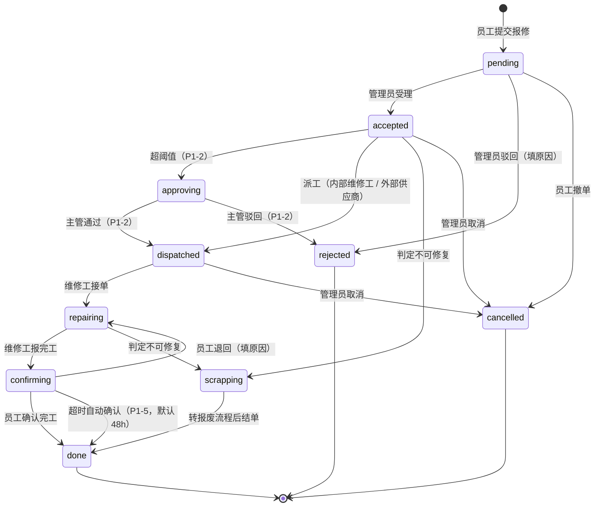
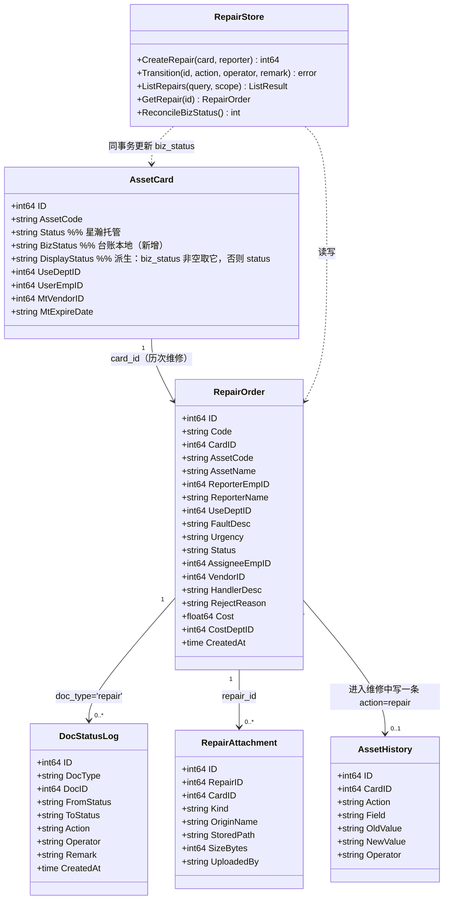
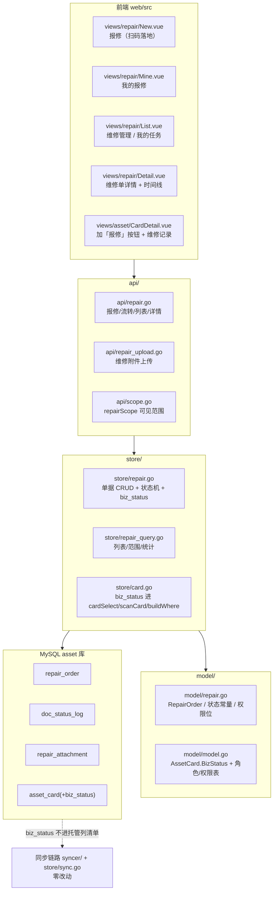
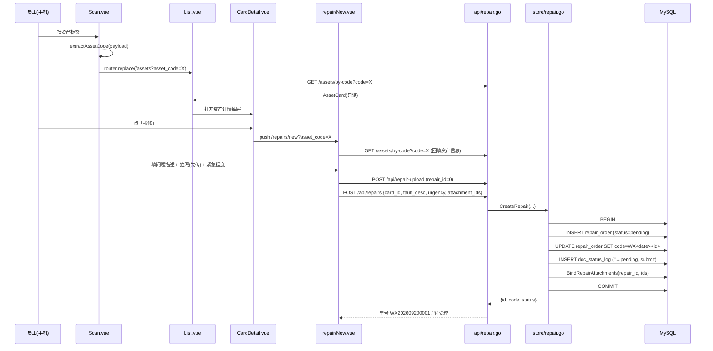
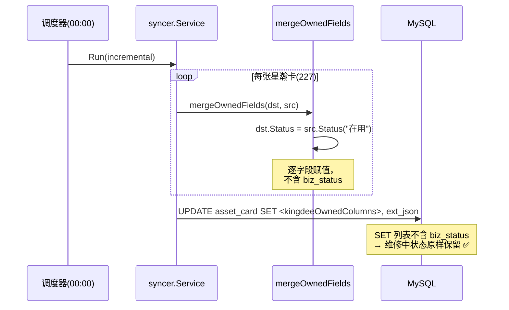
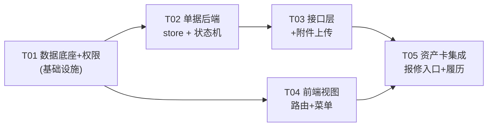

# FAMS 维修流程模块 · 架构建议

| 项 | 内容 |
|---|---|
| 项目 | FAMS · 固定资产台账管理系统（广东某电器集团，**生产在跑**） |
| 文档 | 维修流程模块架构建议（架构设计 + 任务分解） |
| 版本 | v1.0 |
| 编写 | 高见远 · 架构师 |
| 上游输入 | `docs/维修流程模块需求分析.md`（许清楚 · 产品经理） |
| 代码基线 | `main.go` / `api/`（12）/ `store/`（14）/ `syncer/` / `model/` / `integration/` / `web/src/` |
| 语言 | 简体中文 |

> **一句话结论**：本期技术风险只有一个——`asset_card.status` 是星瀚托管列、每日 00:00 会被同步重置。**选型结论：方案 C（新增本地维护列 `biz_status`，与星瀚托管的 `status` 物理分离，同步链路零改动）**；否决 A / D（改同步），B 退为安全兜底。维修模块新增 **3 张表**（`repair_order` / `doc_status_log` / `repair_attachment`）+ **1 个列**（`asset_card.biz_status`），新增/修改 **约 20 个文件**，分 P0 / P1 / P2 三期落地，期与期之间**不返工**。

---

## 0. 结论速览（先给答案）

| # | 决策点 | 结论 | 一句话理由 |
|---|---|---|---|
| R1 | 维修状态如何不被同步抹掉 | **方案 C**：新增本地列 `asset_card.biz_status`，同步零改动 | 改同步的风险远大于加一列；且「托管列 vs 本地列」契约项目里已确立 |
| D1 | 维修单主表 | 新建 `repair_order` | 与 `count_plan` 同构（单号 + 状态机 + 关联资产） |
| D2 | 状态流转记录 | 新建 **通用** `doc_status_log`（带 `doc_type` 判别式） | 纯 append-only 审计表、零业务逻辑，为后续单据流预留 |
| D3 | 附件表 | **新建** `repair_attachment`（不复用 `asset_attachment`） | 归属语义不同：卡档案照 vs 维修凭证，混在一张表里无法按单据收敛 |
| D4 | 费用表 | **并入主表列**（P0/P1 只登记不结算） | 一单一费用，独立表是 1:1 冗余；留列升级路径 |
| D5 | 上传权限 | **新增** `POST /api/repair-upload`（不放宽现有 `/api/upload`） | 现有路由缺对象级鉴权，放宽会暴露 IDOR；维修附件本就有独立归属 |
| D6 | 扫码入口 | **复用** `#/assets?asset_code=X` + 落地页加「报修」按钮 | 存量 227 张标签零重印；深链方案无法兼容旧标签 |
| D7 | 盘点交互 | **不动** `count` 模块 | `GenerateItems` 快照的是 `use_status` 不是生命周期 `status`，本就不受影响 |
| D8 | 星瀚回写 | **不回写** | 维修是台账侧业务，与星瀚无耦合（Q9） |

---

## 1. R1 专项：维修状态与每日同步的冲突（本期最高风险）

### 1.1 问题定性（代码已核实）

| 论断 | 代码证据 |
|---|---|
| `status` 是星瀚托管列 | `store/sync.go:213-221` `kingdeeOwnedColumns`，`"status"` 在 L217 |
| 同步时 `src.Status != ""` 即覆盖 | `store/sync.go:322-324` `mergeOwnedFields` |
| 同步器会给出状态值 | `syncer/syncer.go:320-322` `mapUseStatus(src.UseStatusName)` |
| 「正常使用」→「在用」 | `syncer/syncer.go:559-561` `useStatusMap`，注释「实测金蝶 227 张卡全是正常使用」 |

**后果**：维修流程若写 `asset_card.status = "维修中"`，每天 00:00 定时同步会把它重置回「在用」，维修状态一夜蒸发，资产列表永远看不出哪台在修。

### 1.2 候选方案评估

#### 方案 A —— 维修单存状态真相 + 同步合并处加保护

> 「该资产存在进行中维修单时，同步不覆盖 `status`」

**否决。** 理由：

1. **改的是最不该改的代码。** `mergeOwnedFields` / `ApplyOwnedCardTx` 位于刚经历大重构（组织主数据重建）的同步链路上。README 明确：**「dry-run 与真跑口径必须一致……改动任一分支都要重新验一遍」**。给 `mergeOwnedFields` 加「维修感知」分支，直接破坏这条不变量——dry-run 的 overlay 模拟（`replayOverlay`）与 `diffCard` 都要跟着改，且要重新验证 227 张卡。
2. **耦合方向是反的。** 同步是基础设施层，维修是业务层。让基础设施层去查询业务表（`repair_order`），是把依赖箭头指反了。同步事务内多一次跨模块读，把两张表的生命周期绑在一起。
3. **语义仍是特例。** `status` 依然是星瀚托管列，只是多了一个「除非有进行中维修单」的例外。例外要额外回答：维修结单后恢复成什么值？答案是「同步上次写的值」，而那个值本身已经过期。
4. **风险不对等。** 收益（资产卡状态与业务一致）可以用 C 拿到，代价却是动同步。

#### 方案 D（我额外评估的第四方案）—— 把 `status` 从托管列里摘出来，改由台账独占

**否决。** 这是 A 的变体，同样要动 `kingdeeOwnedColumns` + `ownedCardValues` + `mergeOwnedFields` 三处；而且它**摧毁了 `status` 作为「星瀚状态镜像」的语义**——项目从阶段二起就确立了「托管字段只读」，摘出来等于推翻。新增卡还会因此丢掉「在用」，落到列默认值「闲置」。

#### 方案 B —— 完全不依赖卡片状态

**不采纳为主动方案，但保留为安全兜底。** 零同步改动，但它**没有解决团队真正要解决的问题**——「资产列表上看不出哪台在修」正是 R1 要消除的痛点。B 只是把问题藏起来（状态只在维修单里），用户需求侧没有闭合。

#### 方案 C（推荐）—— 新增本地维护列 `biz_status`，与星瀚托管列物理分离

```sql
ALTER TABLE asset_card ADD COLUMN biz_status VARCHAR(16) NOT NULL DEFAULT '';
```

| 维度 | 说明 |
|---|---|
| **归属** | 台账本地维护列。**绝不**出现在 `kingdeeOwnedColumns` / `cardInitColumns` / `cardWriteColumns` 任一清单里 |
| **语义** | `''` = 无本地业务状态；`'维修中'` = 存在进行中维修单。未来 `'调拨中'` / `'领用中'` 复用同一列 |
| **写入者** | **唯一写入者 = 单据状态机**（维修模块），在「单据状态变更」的**同一事务**内更新 |
| **展示优先级** | `有效状态 = biz_status 非空 ? biz_status : status` |
| **同步影响** | **零**——见 §1.4 |

**选择理由（技术判断，非附和）：**

1. **同步回归风险可证明为零。** `cardInsertStatement` 的 INSERT 列清单 = `kingdeeOwnedColumns + cardInitColumns + created_by + ext_json`；`ApplyOwnedCardTx` 的 UPDATE 只写 `kingdeeOwnedColumns + ext_json`；`mergeOwnedFields` 逐字段合并、不含 `biz_status`；`diffCard` 不比对 `biz_status`。只要 `biz_status` 不进这三个清单，**同步路径逐字节不变**。这是 C 相对 A 的决定性优势：A 的同步风险是「高且难验证」，C 的是「零且可断言」（加一条单测断言 `biz_status ∉ kingdeeOwnedColumns` 即可长期守住）。
2. **职责边界项目里已经确立。** `kingdeeOwnedColumns` 本身就是「星瀚托管列」的契约；`store/mysql.go` 里 `department.source='kingdee'` 只覆盖托管行、手工行保留本地值，是同一套思路的第二次实践。C 是这套契约的**第三次自然延伸**，不是新概念。
3. **为后续单据流预留。** 调拨中 / 领用中与维修中结构同类，都能写进同一个本地状态列，无需每次新增列或改同步。
4. **保持热路径简单。** 资产列表是全局最热查询（列表 / 导出 / 标签 / 扫码 / 盘点范围都走它）。C 只是 `cardSelect` 多一列；而「从单据派生状态」的方案要在最热的 SQL 里挂 `repair_order` 的 JOIN，且每新增一种单据就再挂一个 JOIN——长期是结构性负担。

### 1.3 对团队质疑的正面回答

> **质疑①：加一列会不会造成「两个状态字段并存」的认知混乱？**

**会有认知成本，但要正视它的量级——这不是「两个」，而是「三个状态维度」，且项目本来就已经有两个：**

| 列 | 语义 | 归属 | 现状 |
|---|---|---|---|
| `status` | 生命周期状态（闲置/在用/借用/维修中/调拨中/报废） | 星瀚托管 | 已有 |
| `use_status` | 金蝶「使用状态」（usestatus_name，正常使用/…） | 星瀚托管 | **已有**，`model.go:76-77` 明确注释「与本地维护的 Status 生命周期状态无关」 |
| `biz_status` | 台账本地业务状态（维修中/…） | **台账本地** | 新增 |

也就是说，「多个状态字段并存」**不是 C 引入的新问题，而是项目既有的现实**，且项目已经用一条清晰的注释把它讲清楚了。C 只是把第三个维度的**归属**（星瀚 vs 本地）写死在一个独立列上。

**降低认知成本的三条硬约束（写进代码注释与文档）：**

- `biz_status` **只有一个写入者**（维修单据状态机），且**在单据事务内**写，不允许任何其它模块（含卡片编辑表单、批量改状态）写它。
- `biz_status` **不出现在卡片编辑表单里**（`CARD_SUBMIT_FIELDS` 不加它），用户永远不能手填「维修中」。
- 前端**只认一个派生字段** `display_status`（见 §1.5），不再各自判断优先级。

> **质疑②：前端 / 导出 / 盘点 / 筛选一共多少处要改？会不会有地方漏改导致状态显示不一致？**

**会漏改——所以本方案的关键设计是「把优先级收敛到一个地方」，而不是让每个消费方各判一次。** 见 §1.5。

> **质疑③：C 有没有隐患？**

有一个，且只有一个：**`biz_status` 与「真实进行中单据」之间可能漂移**（例如维修单结单了、但列没清掉）。它无法像「从单据派生」那样天然免疫。**化解方式**：

- 写入与清除都在单据状态机的**同一事务**内（`repair_order` 状态变更 + `asset_card.biz_status` 更新原子提交）；
- 提供一条**对账查询**（体检报告思路，与项目既有 `cmd/kdverify` / 体检报告一脉相承）：
  ```sql
  -- 应报 0 行：列说有维修、但没有进行中单据（或反之）
  SELECT c.id, c.asset_code, c.biz_status FROM asset_card c
  WHERE c.deleted_at IS NULL AND c.biz_status = '维修中'
    AND NOT EXISTS (SELECT 1 FROM repair_order r
                    WHERE r.card_id = c.id AND r.status = 'repairing');
  ```
  这条 SQL 放进 `store/repair.go` 的一个 `ReconcileBizStatus()`，可在同步后或手动触发。

**结论：选 C。** 若未来团队更倾向「零冗余、从单据派生」，**方案 E（把状态派生下沉到 `cardSelect` 的相关子查询）是可接受的替代**，代价是热路径 SQL 复杂度随单据类型数线性增长。E 是 C 的「无冗余版」，二者可平滑互转。

### 1.4 C 对同步链路的回归风险：零

| 同步环节 | 是否感知 `biz_status` | 说明 |
|---|---|---|
| `cardInsertStatement`（新建卡 INSERT） | 否 | 列清单不含它 → 走列默认值 `''` |
| `ApplyOwnedCardTx`（更新 UPDATE） | 否 | SET 只拼 `kingdeeOwnedColumns + ext_json` |
| `mergeOwnedFields`（合并） | 否 | 逐字段赋值，无 `biz_status` |
| `diffCard`（差异 → 履历） | 否 | 不比对 `biz_status` |
| `dryRunOverlay` / `replayOverlay` | 否 | 结构与实跑一致 |

**守护措施**：在 `store/sync.go` 的三个列清单旁加注释「`biz_status` 为台账本地列，禁止加入本清单」，并加单测断言 `biz_status` 不在三个清单中。**改动同步链路的风险为 0，因为不改它。**

### 1.5 改动清单（收敛优先级的核心）

**设计要点**：后端计算一个**派生字段** `display_status = COALESCE(NULLIF(biz_status,''), status)`，随 `AssetCard` 一并下发；**所有展示与筛选都只认 `display_status`**。这样「优先级」只有一处实现，漏改面被压到最小。

| # | 文件 | 位置 | 改什么 | 漏改后果 |
|---|---|---|---|---|
| 1 | `store/mysql.go` | `schema` + `migrate()` | 加 `biz_status` 列（`addColumnIfMissing`） | 列不存在，全挂 |
| 2 | `model/model.go` | `AssetCard` 结构体 | 加 `BizStatus`、`DisplayStatus`（派生，`json:"display_status"`） | 字段缺失 |
| 3 | `store/card.go` | `cardSelect`（L12-35） | SELECT 增列 `c.biz_status` | `scanCard` 列数不符 → **整条查询报错** |
| 4 | `store/card.go` | `scanCard`（L212-252） | 扫描 `biz_status` 并计算 `DisplayStatus` | 列表/详情状态错 |
| 5 | `store/card.go` | `buildWhere`（L74-79） | 状态筛选改 `COALESCE(NULLIF(c.biz_status,''), c.status) IN (...)` | **最易漏**：「筛维修中」筛不出或筛出后列表显示不一致 |
| 6 | `store/card.go` | `sortColumns`（L38-47） | `status` 排序改按有效状态 | 排序与显示不一致（轻微） |
| 7 | `api/importexport.go` | `handleExport`（L62+） | 导出「状态」列写 `display_status` | 导出显示「在用」，与界面不符 |
| 8 | `web/src/views/asset/List.vue` | L79-81 桌面、L101 移动 | `row.status` → `row.display_status`（**两处**） | 列表状态错 |
| 9 | `web/src/views/asset/CardDetail.vue` | L21-23 | `card.status` → `card.display_status` | 详情状态错 |
| 10 | `web/src/api/meta.ts` | `STATUS_TAG`（L44） | 「维修中」已配色，**无需改**；补未来状态色 | 颜色缺失 |

**明确不改的地方**（避免误伤）：

- `cardWriteColumns` / `cardWriteArgs`（`store/card.go:420-442`）：**不加** `biz_status`，卡片表单不能写它。
- `CARD_SUBMIT_FIELDS`（`web/src/api/meta.ts:70`）：**不加** `biz_status`。
- `store/count.go` `GenerateItems`：**不动**（快照的是 `use_status`，与本次无关）。
- `api/card.go` `handleBatchStatus` / `store/card.go` `UpdateCardStatus`：**保持写 `status`**，但**建议从手动状态下拉里移除「维修中 / 调拨中」**（见 §7 待澄清 T3）。

---

## 2. 数据模型（DDL 草案）

**遵循的现有约定**：无 ORM、无真正 FK 约束（外键一律 `BIGINT NOT NULL DEFAULT 0` + `KEY`）；`0` 是「未设置」哨兵值，外键统计带 `> 0` 下界；主数据表**无软删列**、资产卡用 `deleted_at`；单号对齐 `count_plan` 的「先插后回填」做法；表名/列名 snake_case、`ENGINE=InnoDB DEFAULT CHARSET=utf8mb4`。

### 2.1 维修单主表 `repair_order`

```sql
CREATE TABLE IF NOT EXISTS repair_order (
  id BIGINT AUTO_INCREMENT PRIMARY KEY,
  code VARCHAR(32) NOT NULL DEFAULT '',              -- WX<yyyymmdd><0001>，先插后回填（对齐 count_plan.code）
  card_id BIGINT NOT NULL,                            -- 挂 asset_card.id（必填）
  asset_code VARCHAR(64) NOT NULL DEFAULT '',         -- 快照，展示/检索（参照 count_item 快照做法）
  asset_name VARCHAR(128) NOT NULL DEFAULT '',        -- 快照
  reporter_emp_id BIGINT NOT NULL DEFAULT 0,          -- 报修人 employee.id（取 JWT eid）
  reporter_name VARCHAR(64) NOT NULL DEFAULT '',      -- 快照
  use_dept_id BIGINT NOT NULL DEFAULT 0,              -- 使用部门（提交时从卡带出）
  use_dept_name VARCHAR(64) NOT NULL DEFAULT '',      -- 快照
  location VARCHAR(128) NOT NULL DEFAULT '',          -- 快照
  fault_desc VARCHAR(500) NOT NULL DEFAULT '',        -- 问题描述（必填）
  urgency VARCHAR(16) NOT NULL DEFAULT 'normal',      -- low / normal / high
  status VARCHAR(16) NOT NULL DEFAULT 'pending',      -- 状态机（英文码，见 §2.4）
  assignee_emp_id BIGINT NOT NULL DEFAULT 0,          -- 内部维修工 employee.id
  assignee_name VARCHAR(64) NOT NULL DEFAULT '',
  vendor_id BIGINT NOT NULL DEFAULT 0,                -- 外部维保供应商（复用卡的 mt_vendor_id 口径）
  vendor_name VARCHAR(128) NOT NULL DEFAULT '',
  handler_desc VARCHAR(500) NOT NULL DEFAULT '',      -- 维修措施/更换配件说明（完工填）
  reject_reason VARCHAR(255) NOT NULL DEFAULT '',     -- 驳回原因
  cost DECIMAL(14,2) NOT NULL DEFAULT 0,              -- 维修费用（P1-4；P0 恒 0）
  cost_dept_id BIGINT NOT NULL DEFAULT 0,             -- 费用承担部门（P1-4）
  accept_by VARCHAR(64) NOT NULL DEFAULT '',          -- 受理人（审计）
  accept_at DATETIME DEFAULT NULL,
  assign_at DATETIME DEFAULT NULL,
  start_at DATETIME DEFAULT NULL,                     -- 进入维修中
  finish_at DATETIME DEFAULT NULL,                    -- 进入待确认
  confirm_at DATETIME DEFAULT NULL,                   -- 已完工
  close_at DATETIME DEFAULT NULL,                     -- 终态（驳回/撤单/报废）
  created_by VARCHAR(64) NOT NULL DEFAULT '',
  created_at DATETIME DEFAULT CURRENT_TIMESTAMP,
  updated_at DATETIME DEFAULT CURRENT_TIMESTAMP ON UPDATE CURRENT_TIMESTAMP,
  KEY idx_repair_card (card_id),
  KEY idx_repair_status (status),
  KEY idx_repair_reporter (reporter_emp_id),
  KEY idx_repair_assignee (assignee_emp_id),
  KEY idx_repair_dept (use_dept_id),
  KEY idx_repair_created (created_at)
) ENGINE=InnoDB DEFAULT CHARSET=utf8mb4;
```

> **为什么把 `cost` / `cost_dept_id` 现在就放进来**（D4）：P0 不用，但**生产库上后补列比预留两列风险大**；一单对应一费用，独立 `repair_cost` 表是 1:1 冗余。若将来需要「人工/配件/外委」多行费用，再把这两列迁到 `repair_cost`（`repair_id` 已在，迁移是机械的）。

### 2.2 单据状态流转记录表 `doc_status_log`（通用，带判别式）

```sql
CREATE TABLE IF NOT EXISTS doc_status_log (
  id BIGINT AUTO_INCREMENT PRIMARY KEY,
  doc_type VARCHAR(32) NOT NULL,                      -- 'repair'（未来 'transfer' / 'requisition'）
  doc_id BIGINT NOT NULL,                             -- repair_order.id
  from_status VARCHAR(16) NOT NULL DEFAULT '',
  to_status VARCHAR(16) NOT NULL DEFAULT '',
  action VARCHAR(32) NOT NULL DEFAULT '',             -- submit/accept/reject/dispatch/take/finish/confirm/return/cancel/scrap
  operator VARCHAR(64) NOT NULL DEFAULT '',           -- 操作人（姓名，对齐 asset_history.operator）
  remark VARCHAR(500) NOT NULL DEFAULT '',            -- 备注 / 驳回原因 / 退回原因
  created_at DATETIME DEFAULT CURRENT_TIMESTAMP,
  KEY idx_doc_log (doc_type, doc_id, id)
) ENGINE=InnoDB DEFAULT CHARSET=utf8mb4;
```

> **为什么是通用表而不是 `repair_log`**（D2，直接回答团队问题）：这是一张**纯 append-only 审计表、零业务逻辑**——抽错的风险为零；且项目里**判别式先例已存在**（`sync_run.resource`、`external_master_map.kind`、`count_item`）。建成通用表省掉将来在生产表上的一次迁移。

### 2.3 维修附件表 `repair_attachment`

```sql
CREATE TABLE IF NOT EXISTS repair_attachment (
  id BIGINT AUTO_INCREMENT PRIMARY KEY,
  repair_id BIGINT NOT NULL DEFAULT 0,                -- 0 = 先上传待绑定（对齐 asset_attachment 的 card_id=0 约定）
  card_id BIGINT NOT NULL DEFAULT 0,                  -- 冗余，便于按卡查维修照
  kind VARCHAR(16) NOT NULL DEFAULT 'photo',          -- photo / invoice / file
  origin_name VARCHAR(255) NOT NULL DEFAULT '',
  stored_path VARCHAR(255) NOT NULL,                  -- 随机名，落 uploads/ 同一目录
  size_bytes BIGINT NOT NULL DEFAULT 0,
  uploaded_by VARCHAR(64) NOT NULL DEFAULT '',
  created_at DATETIME DEFAULT CURRENT_TIMESTAMP,
  KEY idx_repair_att (repair_id),
  KEY idx_repair_att_card (card_id)
) ENGINE=InnoDB DEFAULT CHARSET=utf8mb4;
```

**论证：新增 `repair_attachment` vs 复用 `asset_attachment`** → **新增**。理由：

| 维度 | 复用 `asset_attachment` | 新增 `repair_attachment` |
|---|---|---|
| 归属 | 只按 `card_id`，一张卡多次维修的照片无法归属到具体某单 | 按 `repair_id` 精确归属 |
| 展示污染 | 维修现场照会混进 `CardDetail` 的资产档案照（`photos`） | 互不干扰 |
| 生命周期 | 维修单关闭后无法收敛其附件 | 可按单清理/归档 |
| 存储层 | 共用 `uploads/` 目录与随机名规则（**这一层复用**） | 同 |

> 存储层（目录、随机名、扩展名白名单、大小限制）**复用**；**元数据层新增一张表**。不抽通用 `doc_attachment`（D3）：现在只有一种单据，YAGNI，且附件→单据的绑定语义因单据而异，抽取留给「规则三」。

### 2.4 状态枚举（后端英文码 / 前端中文白话）

**存储用英文码**（对齐 `count_plan.status = draft/counting/done/cancelled`），**展示用中文白话**（对齐 `count_item.result`）。

| 码 | 白话 | P0/P1 | 说明 |
|---|---|---|---|
| `pending` | 待受理 | P0 | 员工提交后的初始态 |
| `accepted` | 已受理 | P0 | |
| `approving` | 待审批 | P1 | P1-2 超阈值单；**码位从 P0 就定义**，避免后期改词表 |
| `dispatched` | 已派工 | P0 | |
| `repairing` | 维修中 | P0 | **唯一会写 `asset_card.biz_status='维修中'` 的状态** |
| `confirming` | 待确认 | P0 | |
| `done` | 已完工 | P0 | 终态 |
| `rejected` | 已驳回 | P0 | 终态 |
| `cancelled` | 已撤单 | P0 | 终态 |
| `scrapping` | 报废评估 | P1/P2 | |

**关键映射**：`repair_order.status == 'repairing'` → `asset_card.biz_status = '维修中'`（复用既有中文枚举词表，`STATUS_TAG` 配色无需新增）；离开 `repairing` → 清空 `biz_status`。

### 2.5 状态机（Mermaid）



> `approving` / `scrapping` / `超时自动确认` 属 P1，P0 不产生这些跃迁，但码位与状态机表从 P0 即完整——**避免 P1 改状态词表引发前端映射返工**。

### 2.6 数据模型类图（Mermaid）



### 2.7 架构分层图（Mermaid）



---

## 3. 后端模块划分（文件级）

### 3.1 新增文件

| 文件 | 内容 |
|---|---|
| `model/repair.go` | `RepairOrder` / `RepairAttachment` / `DocStatusLog` 结构体；状态常量与中文标签映射；`urgency` 枚举；维修单 `ListQuery` / `ListResult` |
| `store/repair.go` | 单据 CRUD、**状态机流转（唯一写 `biz_status` 的地方）**、单号生成、`ReconcileBizStatus()` 对账 |
| `store/repair_query.go` | 列表查询（按状态/部门/资产/时间筛选 + `repairScope` 收窄）、按卡查维修记录 |
| `api/repair.go` | HTTP 处理器（报修、受理/驳回/派工/接单/完工/确认/退回/撤单、列表、详情、流转记录） |
| `api/repair_upload.go` | 维修附件上传（含对象级鉴权），复用 `uploads/` 与扩展名白名单 |

### 3.2 修改文件

| 文件 | 位置 | 改什么 |
|---|---|---|
| `model/model.go` | 权限位常量（L306-313） | 加 `PermRepairReport/Dispatch/Handle/Approve/Manage` |
| `model/model.go` | 角色常量 + `Roles`（L293-303） | 加 `RoleRepairTech = "repair_tech"` 并入 `Roles` |
| `model/model.go` | `rolePermissions`（L317-331） | 按 §4 配角色权限 |
| `model/model.go` | `AssetCard`（L45-140） | 加 `BizStatus`、`DisplayStatus` |
| `store/mysql.go` | `schema`（L176-483） | 追加 3 张表 DDL |
| `store/mysql.go` | `migrate()`（L39-72） | 加 `biz_status` 列迁移 |
| `store/card.go` | `cardSelect`/`scanCard`/`buildWhere`/`sortColumns` | 见 §1.5 |
| `store/card.go` | `CreatePlan` 同款单号逻辑 | 抽出 `formatDocCode(prefix, id)` 供维修单复用（§7） |
| `store/count.go` | `CreatePlan`（L112） | 改用 `formatDocCode`（纯重构，行为不变） |
| `api/server.go` | `Routes`（L44-122） | 注册维修路由（§3.3） |
| `api/user.go` | `roleBindingErr`（L42-58） | `repair_tech` 必须绑定员工 |
| `api/scope.go` | 新增 `repairScope` | 维修单可见范围（员工/维修工/主管/管理员） |

### 3.3 路由注册（`api/server.go`，现有 65 条）

```go
// —— 维修流程 ——
mux.HandleFunc("POST /api/repairs",                       s.requirePerm(model.PermRepairReport, s.handleCreateRepair))
mux.HandleFunc("GET  /api/repairs",                       s.handleListRepairs)                 // 读接口不门控，靠 scope 收窄
mux.HandleFunc("GET  /api/repairs/{id}",                  s.handleGetRepair)
mux.HandleFunc("GET  /api/repairs/{id}/logs",             s.handleRepairLogs)
mux.HandleFunc("POST /api/repairs/{id}/accept",           s.requirePerm(model.PermRepairDispatch, s.handleAcceptRepair))
mux.HandleFunc("POST /api/repairs/{id}/reject",           s.requirePerm(model.PermRepairDispatch, s.handleRejectRepair))
mux.HandleFunc("POST /api/repairs/{id}/dispatch",         s.requirePerm(model.PermRepairDispatch, s.handleDispatchRepair))
mux.HandleFunc("POST /api/repairs/{id}/take",             s.requirePerm(model.PermRepairHandle,   s.handleTakeRepair))
mux.HandleFunc("POST /api/repairs/{id}/finish",           s.requirePerm(model.PermRepairHandle,   s.handleFinishRepair))
mux.HandleFunc("POST /api/repairs/{id}/confirm",          s.requirePerm(model.PermRepairReport,   s.handleConfirmRepair))
mux.HandleFunc("POST /api/repairs/{id}/return",           s.requirePerm(model.PermRepairReport,   s.handleReturnRepair))
mux.HandleFunc("POST /api/repairs/{id}/cancel",           s.requirePerm(model.PermRepairReport,   s.handleCancelRepair))
mux.HandleFunc("POST /api/repairs/{id}/cost",             s.requirePerm(model.PermRepairManage,   s.handleRepairCost))   // P1-4
mux.HandleFunc("GET  /api/repairs/{id}/attachments",      s.handleRepairAttachments)
mux.HandleFunc("POST /api/repair-upload",                 s.requireAnyPerm(s.handleRepairUpload, model.PermRepairReport, model.PermRepairHandle))
```

> 新增小工具 `requireAnyPerm`（现有 `requirePerm` 只接单个权限）。风格与 `requirePerm` 一致。
> **读接口不门控**——与现有台账约定一致（`api/scope.go:10-14`：看得到就该能看详情），范围限制在**数据行**上做，不在路由上做。

### 3.4 `syncer/` 是否需要改

**不需要。** 取决于 R1 选型：C 不改同步。仅需在 `store/sync.go` 三个列清单旁加注释 + 一条单测断言（§1.4）。

---

## 4. 权限模型

### 4.1 新增权限位（评估产品经理建议）

| 权限位 | 授予角色 | 覆盖动作 | 评估 |
|---|---|---|---|
| `repair.report` | `viewer` / `counter` / `dept_head` / `asset_manager`（admin 隐式） | 提交报修、确认/退回、撤单 | **建议采纳**，但注意：它给 `viewer` 加了一个**写权限**，打破「viewer 纯只读」的既有不变量。这是**有意为之**——报修正是「服务到每一位员工」的核心，且报修天然自收窄（只看得到自己的单）。需在文档与代码注释里写明。 |
| `repair.dispatch` | `asset_manager` | 受理 / 驳回 / 派工 / 取消 | 采纳 |
| `repair.handle` | **`repair_tech`（新角色）** | 接单 / 报完工 | 采纳 |
| `repair.approve` | `dept_head` / `asset_manager` | P1-2 超阈值审批 | 采纳（P1 用，码位 P0 即定义） |
| `repair.manage` | `asset_manager` | 费用登记（P1-4）、配置 | 采纳 |

> **产品经理建议的 5 个权限位全部采纳**，无需增减。仅补充一处语义说明：`repair.report` 同时承担「报修人对自己单据的确认/退回/撤单」——因为报修人本就是这个动作的合法主体，无需再拆一个 `repair.confirm`。

### 4.2 新增角色 `repair_tech`

```go
// model/model.go
const RoleRepairTech = "repair_tech"
var Roles = []string{RoleAdmin, RoleAssetManager, RoleCounter, RoleDeptHead, RoleRepairTech, RoleViewer}

var rolePermissions = map[string]map[string]bool{
    RoleAssetManager: { PermAssetManage: true, PermMasterManage: true, PermCountManage: true, PermCountEnter: true,
                        PermRepairReport: true, PermRepairDispatch: true, PermRepairApprove: true, PermRepairManage: true },
    RoleCounter:      { PermCountEnter: true, PermRepairReport: true },
    RoleDeptHead:     { PermRepairReport: true, PermRepairApprove: true },
    RoleRepairTech:   { PermRepairHandle: true },
    RoleViewer:       { PermRepairReport: true },   // 唯一给 viewer 的写权限，见 §4.1
}
```

### 4.3 ⚠️ 关键坑：权限映射有**两份**，必须同步改

| # | 位置 | 改什么 |
|---|---|---|
| 1 | **后端** `model/model.go` `rolePermissions`（L317-331）+ `Roles`（L303） | 权限表 + 角色列表 |
| 2 | **前端** `web/src/stores/auth.ts` `rolePermissions`（L25-33）+ `roleLabels`（L35-41） | 等价映射 + 中文标签 |

**漏改后果**：菜单/按钮与后端不一致——要么「按钮显示但点下去 403」，要么「后端允许但界面没入口」。

```ts
// web/src/stores/auth.ts 同步修改
const rolePermissions: Record<string, string[]> = {
  asset_manager: ["asset.manage","master.manage","sync.manage","count.manage","count.enter",
                  "repair.report","repair.dispatch","repair.approve","repair.manage"],
  counter:  ["count.enter", "repair.report"],
  dept_head:["repair.report", "repair.approve"],
  repair_tech: ["repair.handle"],
  viewer:   ["repair.report"],
};
const roleLabels: Record<string, string> = {
  admin: "管理员", asset_manager: "资产管理员", counter: "盘点员",
  dept_head: "部门负责人", repair_tech: "维修工", viewer: "只读",
};
```

**另有两处必须同步改（易被忽略）：**

| # | 位置 | 改什么 |
|---|---|---|
| 3 | `api/user.go` `roleBindingErr`（L42-58） | `case RoleRepairTech:` 要求 `employeeID != 0`（否则建号后无法被指派到任何单） |
| 4 | `api/scope.go` | 新增 `repairScope`，`repair_tech` → `{AssigneeEmpID: u.EmployeeID}`；`viewer` → `{ReporterEmpID: u.EmployeeID}`；`dept_head` → `{DeptIDs: deptSubtree(...)}` |

### 4.4 上传权限放权方案（D5）

**现状**：`POST /api/upload` 被 `requirePerm(model.PermAssetManage)` 门控（`api/server.go:93`），`viewer` 权限表为空 → **员工传不了维修照片**。

**评估两条路：**

| 方案 | 做法 | 安全性评估 |
|---|---|---|
| 放宽现有路由 | 把 `/api/upload` 的门控放开 | **否决**。该 handler 直接信任表单里的 `card_id` 调 `SaveAttachment`，**没有对象级鉴权**（`api/upload.go:62-67`）。现在因门控挡住了低权限用户，一旦放开，任何登录用户可给**任意资产**挂附件（IDOR）。 |
| **新增维修专用路由** | `POST /api/repair-upload`，门控 `repair.report`/`repair.handle` | **采纳**。见下 |

**`POST /api/repair-upload` 的安全设计：**

1. **认证**：由 `Authenticate` 中间件统一强制（无 token → 401）。
2. **授权（功能级）**：`requireAnyPerm(repair.report, repair.handle)`。
3. **授权（对象级）**：handler 校验「当前用户是否有权给目标单据/资产上传」——报修单的报修人、或该单的指派维修工、或 `asset_manager`/`admin`。**这一层堵住 IDOR**。
4. **存储复用**：同一 `uploads/` 目录、同一随机名规则、同一扩展名白名单（`api/upload.go:15-17`）、同一大小上限 → **不引入新攻击面**。
5. **两段式上传**：报修时照片先于单据存在，沿用 `asset_attachment` 的 `card_id=0` 先传后绑约定 → `repair_attachment.repair_id=0` 暂存，提交时 `BindRepairAttachments(repairID, ids)` 回填（对齐 `store/attachment.go:48`）。

---

## 5. 前端视图与路由

### 5.1 新增视图 `web/src/views/repair/`

| 视图 | 面向 | 内容 |
|---|---|---|
| `New.vue` | 员工 | 扫码落地报修页：资产信息**只读带出**、问题描述（必填）、拍照、紧急程度（可选）；手工填 ≤ 3 项 |
| `Mine.vue` | 员工 | 「我的报修」列表（默认只含本人提交），状态白话 + 处理人 + 最近变更时间 |
| `List.vue` | 管理员 / 主管 / 维修工 | 维修单列表（状态/部门/资产/时间筛选 + 分页）。**同一视图按角色收窄**：管理员看全部、主管看本部门子树、维修工只看派给自己的（`mine=1`） |
| `Detail.vue` | 全部 | 维修单详情：基本信息 + 状态时间线（`doc_status_log`）+ 附件 + 按角色/状态显示操作按钮 |

> **不新增「我的任务」独立视图**——维修工的「派给我的单」由 `List.vue` + 服务端 `repairScope` 收窄实现，少一个视图即少一处维护。若移动端体验不足，P1 再拆（视图拆分是纯前端改动，不影响后端）。

### 5.2 路由（`web/src/router/index.ts`，现有 L4-28）

```ts
{ path: "repairs/new",  name: "repair-new",    component: () => import("../views/repair/New.vue") },
{ path: "repairs/mine", name: "repair-mine",   component: () => import("../views/repair/Mine.vue") },
{ path: "repairs",      name: "repairs",       component: () => import("../views/repair/List.vue") },
{ path: "repairs/:id",  name: "repair-detail", component: () => import("../views/repair/Detail.vue") },
```

### 5.3 菜单（`web/src/layouts/SideMenu.vue`）

现有菜单项**全部** `v-if="auth.can(...)"`，新菜单项沿用同一模式：

```vue
<el-menu-item v-if="auth.can('repair.report')" index="/repairs/mine">
  <el-icon><Bell /></el-icon><span>我的报修</span>
</el-menu-item>
<el-menu-item v-if="auth.can('repair.handle')" index="/repairs?mine=1">
  <el-icon><Tools /></el-icon><span>我的维修</span>
</el-menu-item>
<el-menu-item v-if="auth.can('repair.dispatch')" index="/repairs">
  <el-icon><List /></el-icon><span>维修管理</span>
</el-menu-item>
```

### 5.4 扫码入口论证（D6）

**读代码后的结论：复用 `#/assets?asset_code=X` + 落地页加「报修」按钮。**

证据链：

- `qr.ts:7` `assetQrUrl` 生成的标签 URL = `${base}/#/assets?asset_code=${code}`——**存量 227 张标签就是这个形态**。
- `qr.ts:26` `extractAssetCode` 已能从任意含 `asset_code` 的 hash 串解析编码（对 `#/repair/new?asset_code=X` 也适用）。
- `Scan.vue:164` `go()` 硬编码 `router.replace({ name: "assets", query: { asset_code: code } })`。
- `List.vue:291-307` `watch(route.query.asset_code)` → 调 `/assets/by-code` → 打开 `CardDetail` 抽屉。

| 方案 | 存量标签 | 新标签 | 落地体验 | 改动量 |
|---|---|---|---|---|
| **① 复用 `#/assets` + 落地页加「报修」按钮** | ✅ 零重印 | ✅ 一致 | 扫 → 资产详情 → 点「报修」 | 极小（CardDetail 加一个按钮） |
| ② 新增深链 `#/repair/new?asset_code=X` | ❌ 系统相机扫旧标签直接进 `#/assets`，仍需按钮兜底 | ✅ | 扫 → 直接进报修页 | 需重印标签 + 仍要改落地页 |

**否决②作为替代方案**：它**不能兼容旧标签**（系统相机/微信扫旧标签打开的是 `#/assets`，绕过了 `Scan.vue`），所以②单独用一定不一致；而「②+①同时做」才一致，但那样已经包含①的工作量，却多付 227 张标签的重印成本。

**建议**：本期只做①。未来若想给**新标签**做「扫完直进报修」，可生成 `#/repair/new?asset_code=X`（`extractAssetCode` 已能解析），**旧标签仍走①的按钮**——两种标签并存、互不破坏。此为**纯增量**，不返工。

**落地页改动**：`CardDetail.vue` 基本信息页加「报修」按钮（`v-if="auth.can('repair.report')"`），点击 → `router.push({ name: 'repair-new', query: { asset_code: card.asset_code } })`。

---

## 6. 与现有模块的集成点

| # | 现有能力 | 集成方案 | 是否改现有代码 |
|---|---|---|---|
| 1 | **二维码标签**（`api/labels.go` / `qr.ts` / `Scan.vue`） | 标签 URL **不变**；`CardDetail.vue` 加「报修」按钮 | 仅 CardDetail（+按钮） |
| 2 | **资产卡履历**（`asset_history`） | 进入「维修中」时复用 `addHistoryTx(tx, cardID, "repair", "状态", old, "维修中", op)`（`store/history.go:83`）；`CardDetail.vue` `ACTIONS` 加 `repair: "维修"` | 复用，不改结构 |
| 3 | **资产卡维修记录** | `CardDetail.vue` 加「维修记录」条带（仿 `count-strip`），调 `GET /api/repairs?card_id=X` | 前端新增，后端新接口 |
| 4 | **盘点**（`store/count.go`） | **不动**。`GenerateItems` 快照的是 `use_status`（金蝶使用状态），**未快照生命周期 `status`**（`store/count.go:220-225`）→ 维修状态本就不影响盘点快照。规则：**维修中资产仍在现场、仍纳入盘点**（Q6 = 不影响） | 否 |
| 5 | **附件存储**（`uploads/`） | 维修附件落**同一目录**、同一随机名/白名单规则；元数据进 `repair_attachment` | 复用存储层 |
| 6 | **云之家**（`integration/yunzhijia/`） | 现只有 `GetAppToken` + `ResolveUser`（**无发消息**）。P1-3 需**扩展** `client.go` 增 `SendMessage(...)`；**fire-and-forget**，推送失败只记日志、不阻塞主流程 | P1 扩展 |
| 7 | **星瀚同步**（`syncer/` / `store/sync.go`） | **不回写**（Q9）；`biz_status` 不进任何托管列清单 → 同步零改动 | 否（仅加守护注释/单测） |
| 8 | **主数据**（`employee`/`department`/`vendor`） | 维修单只存 `*_id` 引用 + 姓名/部门名**快照**（参照 `count_item` 做法），主数据仍是引用 | 复用 |

### 6.1 关键时序图

**S1 员工扫码报修**



**S2 受理 → 派工 → 接单 → 完工（含 biz_status 写入）**

```mermaid
sequenceDiagram
    participant M as 管理员
    participant T as 维修工
    participant API as api/repair.go
    participant ST as store/repair.go
    participant DB as MySQL

    M->>API: POST /repairs/{id}/accept
    API->>ST: Transition(accept)
    ST->>DB: UPDATE status=pending→accepted; INSERT doc_status_log

    M->>API: POST /repairs/{id}/dispatch {assignee_emp_id | vendor_id}
    API->>ST: Transition(dispatch)
    ST->>DB: UPDATE status=accepted→dispatched; INSERT doc_status_log

    T->>API: POST /repairs/{id}/take
    API->>ST: Transition(take)
    ST->>DB: BEGIN
    ST->>DB: UPDATE status=dispatched→repairing
    ST->>DB: UPDATE asset_card SET biz_status='维修中' WHERE id=card_id
    ST->>DB: INSERT asset_history(action='repair', 状态 old→维修中)
    ST->>DB: INSERT doc_status_log
    ST->>DB: COMMIT

    T->>API: POST /repairs/{id}/finish {handler_desc, attachment_ids}
    API->>ST: Transition(finish)
    ST->>DB: BEGIN
    ST->>DB: UPDATE status=repairing→confirming
    ST->>DB: UPDATE asset_card SET biz_status='' WHERE id=card_id
    ST->>DB: INSERT doc_status_log
    ST->>DB: COMMIT
```

**S3 每日同步与 `biz_status` 的隔离（验证 R1）**



---

## 7. 分阶段落地路线图（P0 → P1 → P2，期与期不返工）

**预留设计（P0 就做，避免后期返工）：**

- `repair_order` 含 `cost` / `cost_dept_id`（P1-4 只填不改表）；
- 状态码表含 `approving` / `scrapping`（P1 只启用不改词表）；
- 权限位含 `repair.approve` / `repair.manage`（P1 只授权不改映射）；
- `doc_status_log` 带 `doc_type`（后续单据流直接复用）；
- `asset_card.biz_status` 从 P0 存在（后续状态复用同列）。

| 阶段 | 新增表 | 新增文件 | 新增接口 | 前置预留 |
|---|---|---|---|---|
| **P0 最小可用闭环** | `repair_order`、`doc_status_log`、`repair_attachment`、`asset_card.biz_status` | `model/repair.go`、`store/repair.go`、`store/repair_query.go`、`api/repair.go`、`api/repair_upload.go`、`views/repair/{New,Mine,List,Detail}.vue` | 报修、列表、详情、流转记录、受理/驳回/派工/接单/完工、**确认/退回**、附件上传/列表 | — |
| **P1 效率与管控** | 无（复用 P0 列/表） | `integration/yunzhijia` 扩 `SendMessage`；超时巡检任务 | 费用登记（P1-4）、审批（P1-2）、云之家推送（P1-3）、超时提醒（P1-5） | `cost` 列、`approving` 码、`repair.approve` 权限 |
| **P2 增值能力** | 无（如需「维修成本报表」可加物化视图/索引） | 报表页、自助排查页、预防性维保单 | 成本统计（P2-1）、知识库（P2-2）、到期提醒（P2-3）、供应商入口（P2-4）、备件领用（P2-5） | `mt_expire_date`（已有） |

> **⚠️ 需求侧缺口（见 §9 待澄清 T1）**：按产品经理的优先级，**「员工确认完工」属 P1-1**，则 P0 的维修单永远停在 `confirming`、到不了 `done`（`done` 只能靠 P1-5 的超时自动确认）。**建议 P0 就带一个最简「确认完工」动作**（由报修人或管理员触发），否则 P0 的闭环不闭合。本路线图按「P0 含确认/退回」规划，请产品经理确认。

---

## 8. 为后续单据流预留什么 / 不该过度设计什么

背景：`docs/项目介绍.md`《关键设计决策》明确 **「领域固化，不做元数据驱动」**；《待推进事项》写明二期单据流（入库单、领用退库、调拨、折旧计提）。维修单与它们**结构同类**（单据号 + 资产卡关联 + 状态流转 + 审批 + 附件 + 留痕）。

**逐项判断：**

| 项 | 抽 / 不抽 | 理由 |
|---|---|---|
| **单据号生成器** | ✅ **抽**（**仅**格式化函数，**不做**通用序列表） | 每个单据都要「前缀 + 日期 + 序号」。`count_plan`（`PD<date><id>`）已在 `store/count.go:112` 内联实现。抽一个纯函数 `formatDocCode(prefix string, id int64) string` 供两处复用，**零风险、可单测**。**不做**通用 `doc_sequence` 表——现有「先插拿自增 id、再回填编码」的做法已保证唯一，加表是过度设计。 |
| **统一状态流转记录表** | ✅ **抽**（`doc_status_log` + `doc_type`） | 纯 append-only 审计表、**零业务逻辑**，抽错的概率为零；项目已有判别式先例（`sync_run.resource` / `external_master_map.kind`）。建成通用表省掉将来在生产表上的迁移。 |
| **通用审批表** | ❌ **不抽** | 通用审批 = 工作流引擎的楔子（审批人 / 阈值 / 多级 / 会签），**明令禁止**。P1-2 只需「超阈值单进入 `approving` + 主管通过/驳回」，用**状态码 + `doc_status_log` 的 action** 就能表达，不需要独立审批表。 |
| **通用附件表** | ❌ **不抽**（先 per-module，规则三再抽） | 附件→单据的绑定语义因单据而异；现在只有一种单据（维修），预建 `doc_attachment` 需要预先设想所有单据的公共字段，易设计错。抽取是**机械迁移**（加 `doc_type` 判别式），等第二个单据流落地再做。**存储层（`uploads/`）已复用**，这才是真正的共性。 |
| **通用单据主表 / 元数据驱动** | ❌ **不抽** | 直接违反「领域固化」决策。单一集团用不上多租户低代码那套。 |
| **通用状态机引擎** | ❌ **不抽** | 每个单据的状态机跃迁规则都是领域固化的（写死在 `store` 层 switch 里），通用化=规则引擎，禁止。 |

**一句话**：**抽「无业务逻辑的形状」（单号格式化、状态流转日志），不抽「有业务逻辑的机制」（审批、工作流、元数据）。** 前者抽错零成本，后者抽错即过度设计。

---

## 9. 关键决策与权衡表 + 风险与待明确事项

### 9.1 关键决策与权衡

| # | 决策 | 选择 | 被否决方案 | 权衡 |
|---|---|---|---|---|
| R1 | 维修状态 vs 同步覆盖 | **C：新增本地列 `biz_status`** | A / D（改同步）；B（不依赖卡片状态） | 换来同步零回归；代价 = 第三个状态维度（可注释约束）+ 需一条对账 SQL |
| D3 | 维修附件表 | **新建 `repair_attachment`** | 复用 `asset_attachment` | 换来归属清晰；代价 = 多一张表 |
| D4 | 费用表 | **并入主表列** | 独立 `repair_cost` 表 | 换来简单；代价 = 多行费用需将来迁移（机械） |
| D5 | 上传权限 | **新增 `/api/repair-upload`** | 放宽 `/api/upload` | 换来不暴露 IDOR；代价 = 多一个路由 + 对象级鉴权 |
| D6 | 扫码入口 | **复用旧深链 + 落地页按钮** | 新增深链 | 换来零重印；代价 = 多一次点击（详情页 → 报修） |
| D2 | 状态流转记录 | **通用 `doc_status_log`** | 本模块 `repair_log` | 换来后续单据复用；代价 = 提前引入 `doc_type` 判别式（风险极低） |
| D7 | 盘点交互 | **不动 count** | 快照生命周期状态 | 换来零回归；代价 = 「维修中」标注需 P1/P2 在报告侧 JOIN 派生 |

### 9.2 风险表

| # | 风险 | 等级 | 缓解 |
|---|---|---|---|
| R1 | 维修状态被同步抹掉 | **高** | 方案 C：物理分离列 + 同步零改动 + 单测断言 `biz_status ∉ 托管列清单` |
| R2 | **权限两份映射漏改一份** | **高** | §4.3 明确列出 4 处（`model.go` ×2、`auth.ts` ×2、`api/user.go`、`api/scope.go`）；建议加一条「前端权限表与后端 rolePermissions 一致性」的单测/校验脚本 |
| R3 | `biz_status` 与真实单据漂移 | 中 | 单据事务内原子写；`ReconcileBizStatus()` 对账 SQL（§1.3） |
| R4 | 状态显示不一致（筛选/导出/列表） | 中 | 后端派生 `display_status` 单点收敛；§1.5 逐处清单 |
| R5 | 上传接口 IDOR | 中 | 新路由 + 对象级鉴权（§4.4）；不放宽旧路由 |
| R6 | 员工端仍看到管理向界面 | 低 | P0 靠「扫码 → 详情 → 报修」规避；P1-6「我的资产」首页改善 |
| R7 | 云之家推送失败阻塞主流程 | 低 | fire-and-forget，失败仅记日志（P1-3） |
| R8 | P0 无法结单（无确认动作） | 中 | §7 建议 P0 含最简确认动作 |

### 9.3 待明确事项（需产品经理 / 老板拍板，**架构侧不擅自改需求**）

| # | 事项 | 影响 | 架构侧建议 |
|---|---|---|---|
| **T1** | P0 是否含「确认完工」？（产品经理把确认归 P1-1） | 决定 P0 能否闭合到 `done` | **建议 P0 含最简确认**（报修人或管理员），否则 P0 单据停在 `confirming` |
| **T2** | `viewer` 是否授予 `repair.report`（写权限）？ | 打破「viewer 纯只读」不变量 | **建议授予**——报修是「服务到每一位员工」的核心，且自收窄 |
| **T3** | 现有「批量调整状态」下拉里的**「维修中 / 调拨中」**如何处置？ | 管理员手填「维修中」写 `status` → **次日被同步抹掉**（既有潜在缺陷） | **建议从手动下拉移除这两个状态**，改由单据驱动；需产品确认这是 UX 变更 |
| **T4** | 「待确认」时资产是否算「维修中」？ | 决定 `biz_status` 清除时机 | 建议**报完工即清 `biz_status`**（物理维修已结束），与产品经理 §3.4 表一致 |
| **T5** | 部门主管可见范围是否需要部门子树？ | 决定 `repairScope` 实现 | 建议**复用** `api/scope.go` 的 `deptSubtree`（已有实现） |
| **T6** | 维修工是内部 / 外部 / 两者并存（Q2）？ | 决定是否需要供应商协同入口 | 建议 **P0 仅内部**（`repair_tech`），外部供应商（P2-4）另议 |
| **T7** | 是否需要历史维修记录迁移（Q12）？ | 决定是否需要导入模板 | 建议**从零开始** |
| **T8** | 费用是否需与财务/ERP 打通（Q3）？ | 决定是否触碰星瀚 | 建议**只登记不结算**（P1-4），不触碰星瀚 |

---

## 10. 任务分解（供工程师排期，≤ 5 个任务）

> 按「功能模块 / 层次」分组，不按单文件拆分；T01 为项目基础设施（含依赖与配置）。

| 任务 | 名称 | 源文件（新增 / 修改） | 依赖 | 优先级 |
|---|---|---|---|---|
| **T01** | 数据底座 + 权限模型（基础设施） | 新增 `model/repair.go`；修改 `model/model.go`（AssetCard.BizStatus/DisplayStatus + 角色/权限位 + RoleRepairTech）、`store/mysql.go`（3 张表 DDL + `biz_status` 列迁移）、`api/user.go`（roleBindingErr）、`store/card.go`（cardSelect/scanCard/buildWhere/sortColumns + `formatDocCode` 抽取）、`store/count.go`（改用 formatDocCode）、`web/src/stores/auth.ts`（两份映射同步）、`web/src/api/meta.ts`（列/标签） | — | P0 |
| **T02** | 维修单据后端（store + 状态机） | 新增 `store/repair.go`、`store/repair_query.go`；修改 `api/scope.go`（repairScope） | T01 | P0 |
| **T03** | 维修接口层 + 附件上传 | 新增 `api/repair.go`、`api/repair_upload.go`；修改 `api/server.go`（路由注册 + requireAnyPerm） | T02 | P0 |
| **T04** | 前端维修视图 + 路由 + 菜单 | 新增 `views/repair/{New,Mine,List,Detail}.vue`；修改 `router/index.ts`、`layouts/SideMenu.vue` | T01 | P0 |
| **T05** | 资产卡集成（报修入口 + 履历 + 维修记录） | 修改 `views/asset/CardDetail.vue`（报修按钮 + ACTIONS.repair + 维修记录条带）、`views/asset/List.vue`（display_status ×2）、`api/importexport.go`（导出 display_status） | T03, T04 | P0 |

**任务依赖图**



**关键路径**：T01 → T02 → T03 → T05（T04 可与 T02/T03 并行）。

---

## 附录：共享知识（供工程师实现时遵守）

```
1. 所有读接口不门控，可见范围在数据行上收窄（api/scope.go 既有约定）。
2. 外键一律 BIGINT NOT NULL DEFAULT 0；0 = 未设置哨兵值；统计带 > 0 下界。
3. 资产卡软删除 deleted_at；主数据表无软删列；维修单靠终态归档（无 deleted_at）。
4. 单号格式：WX<yyyymmdd><0001>，先 INSERT 拿自增 id、再 UPDATE 回填（对齐 count_plan）。
5. 状态存储用英文码、展示用中文白话；repairing ↔ asset_card.biz_status='维修中'。
6. biz_status 唯一写入者 = 维修单据状态机，且在同一事务内写；不进任何卡片编辑/导入字段清单。
7. display_status = COALESCE(NULLIF(biz_status,''), status)，所有展示/筛选/导出只认它。
8. 权限映射两份必须同步：model/model.go rolePermissions ↔ web/src/stores/auth.ts rolePermissions。
9. 单据流转记录写 doc_status_log（doc_type='repair'）；资产履历写 asset_history（action='repair'，仅进入维修中时一条）。
10. 附件复用 uploads/ 目录与随机名规则；元数据进 repair_attachment；两段式上传（repair_id=0 先传后绑）。
11. 同步链路零改动：biz_status 绝不加入 kingdeeOwnedColumns / cardInitColumns / cardWriteColumns。
12. 修改任何单据状态都必须经 store 层单一入口 Transition()，禁止散落 UPDATE。
```
