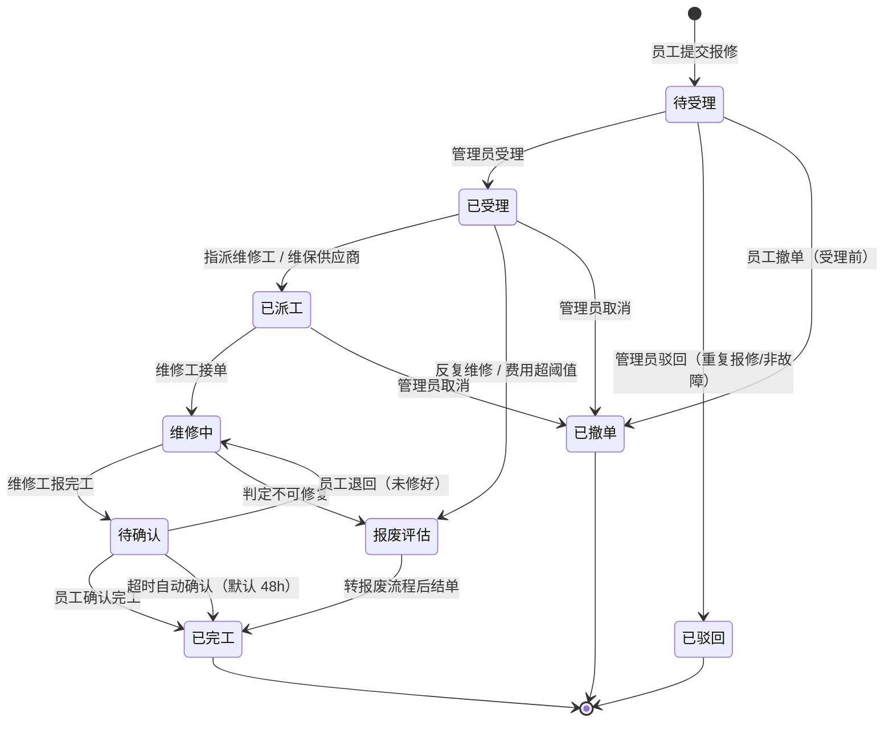

# FAMS 维修流程模块需求分析

| 项 | 内容 |
|---|---|
| 项目 | FAMS · 固定资产台账管理系统（广东某电器集团，生产在跑） |
| 文档 | 维修流程模块需求分析 |
| 版本 | v1.0（需求分析阶段） |
| 编写 | 许清楚 · 产品经理 |
| 语言 | 简体中文 |
| 依据 | `docs/项目介绍.md`、`README.md`、`api/`、`store/`、`syncer/`、`web/src/` 实际代码 |

> **一句话结论**：把系统从「资产管理员的台账工具」升级为「员工可自助的资产服务平台」；第一期以**扫码即报修**为唯一入口、以**维修单状态机**为主线，复用现有资产卡 / 二维码 / 附件 / 履历能力。同时必须正面处理一个硬约束——**每日 00:00 的星瀚同步会把 `asset_card.status` 覆盖回「在用」**（见 §3.5 风险 R1），否则维修状态会一夜之间被抹掉。

---

## 0. 背景与诉求拆解

用户原话：

> 「导入一个系统设计思路或者说是宗旨：我们设计的系统应该是服务到每一位员工，提升工作便捷和高效。后面我们将规划下增加一些可针对资产设备提交一些维修流程之类的设计模块……」

拆成两个诉求：

| # | 诉求 | 本文件对应章节 |
|---|---|---|
| 1 | 确立系统设计宗旨：从「管理员台账」升级为「服务到每一位员工的资产服务平台」 | §一、§二 |
| 2 | 规划维修流程模块：员工能对资产提交维修申请，走受理/派工/完工流程 | §三 |

**现状约束（读代码确认，直接影响需求设计）**：

- 组织主数据（公司/部门/员工）与资产卡由星瀚 ERP **托管**，每日 00:00 定时同步（先组织、后资产卡）；台账侧不维护主数据。
- 资产卡**软删除**（`deleted_at`），所有查询必须带 `deleted_at IS NULL`。
- `0` 是「未设置」哨兵值，不是外键值。
- 权限模型很薄：`sys_user.role` + `dept_id`，5 个固定角色（`admin / asset_manager / counter / dept_head / viewer`），权限位 6 个（`asset.manage / master.manage / sync.manage / count.manage / count.enter / user.manage`）。
- 已有云之家（企业微信类）集成，但目前**只有 ticket 免登**，没有消息推送能力。
- 已有附件上传能力，但上传接口只对 `asset.manage` 开放。
- 全代码库**没有任何**维修/报修实现（除状态枚举里的「维修中」）。

---

## 一、设计宗旨的落地拆解

宗旨：**服务到每一位员工，提升工作便捷和高效。**

抽象口号无法验收，下面把它拆成 **5 条可判定的产品设计原则**。每条原则都给出「判据」——满足它就是「该做」，违反它就是「不该做」。

| # | 原则 | 可验收判据 | 意味着**要**做 | 意味着**不做** |
|---|---|---|---|---|
| 原则 1 | **零学习成本**：新员工无需培训、无需文档即可完成核心动作 | 一名从未用过本系统的员工，在**不看任何说明、不经任何培训**的前提下，能在 **60 秒内**完成一次报修 | 单一入口（扫码）；默认带出全部资产信息；只填「哪儿坏了」+ 可选拍照 | 多级菜单；要求先选公司→再选部门→再选资产；必填专业字段（故障分类编码、工单类型、成本中心） |
| 原则 2 | **员工只做他必须做的事**：系统替他填 | 报修单中由员工**手工填写**的字段 ≤ **3 个**（问题描述、照片、可选紧急程度）；资产编号/名称/使用部门/位置/维保供应商全部自动带出 | 扫码 → 资产信息自动回填；员工身份从登录态取，不问「你是谁」 | 让员工手填资产编码、部门、资产名称；让员工上传前先建目录/选分类 |
| 原则 3 | **动作可预期**：同一动作在任何端、任何角色结果一致 | 手机与 PC、员工与管理员，「提交报修」的校验规则与结果提示完全一致；提交后**立即**返回唯一单号与当前状态 | 提交后返回单号 + 状态；状态名用业务白话（已受理 / 维修中 / 已完工），不用内部代码 | 员工端只提示「提交成功」却不知后续去哪看；PC 与手机两套规则 |
| 原则 4 | **信息只在源头录一次**：不让信息在系统间漂移、不重复劳动 | 资产信息、使用人、部门、维保供应商只从资产卡/星瀚读取，维修模块**不维护第二份**；维修记录回写到资产卡履历 | 维修单挂 `card_id`；完工写 `asset_history`；同一资产的历次维修在一张卡上可查 | 在维修模块里重建一张资产表；让员工选资产名称 |
| 原则 5 | **每个人都看得见与自己有关的事**：闭环可追踪，不靠人追问 | 报修人能随时看到自己单子的状态与处理人；维修工只看到派给自己的单；管理员看到全部；任何状态变更都留痕（谁、何时、从什么到什么） | 列表默认按「与我相关」过滤；状态变更写操作日志 | 只有管理员能查单、员工只能打电话问进度 |

**这 5 条原则如何裁决一个需求**（示例）：

- 「给报修加 5 级审批」→ 违反原则 1、2（员工被迫理解组织架构）→ **不做**（大额审批走 P1，且只对超阈值单触发，不让普通报修感知）。
- 「报修时让员工选资产分类」→ 违反原则 4（分类在资产卡上已有）→ **不做**。
- 「扫码后直接进报修页，资产信息只读带出」→ 同时满足原则 1、2、3、4 → **该做，且是 P0 第一需求**。

---

## 二、用宗旨反观现有系统

下面每一条都是**读代码后可查证**的具体违背点，不泛泛而谈。

| # | 违背点 | 具体证据（文件 / 页面 / 行） | 对员工的影响 | 本模块是否解决 |
|---|---|---|---|---|
| 1 | **员工没有「自己的」页面，登录即落到管理向列表** | `web/src/router/index.ts` 无员工首页路由；`web/src/layouts/SideMenu.vue` 菜单项全部 `v-if="auth.can(...)"`，`viewer` 角色只可见「资产列表」一项 | 员工第一眼是一张带「批量导入/导出/打标签/批量改状态」的管理表格，与他的诉求无关 | 部分（P0-5 我的报修；P1-6 我的资产首页） |
| 2 | **员工账号是「顺带建的」，没有引导** | `api/sso.go` L57–67：云之家首次免登、工号命中员工时自动 `CreateSSOUser(..., RoleViewer, empID)`；无通知、无欢迎页、无「你能做什么」 | 员工不知道自己被建了账号、也不知道进去能干什么 | 是（新增员工入口与引导） |
| 3 | **可见范围窄，但页面不匹配** | `api/scope.go` L20–26：`RoleViewer → AssetScope{SelfEmpID: u.EmployeeID}`；`web/src/stores/auth.ts` L45–48 `scopeHints`「仅显示你名下的资产」；但页面仍是 `views/asset/List.vue` | 员工看到一堆用不上的管理操作，提示也解释不清 | 是 |
| 4 | **报修完全没有入口** | `api/server.go` 路由表 65 条中**无任何**维修/报修接口；全库 `*.go / *.vue / *.ts` 除 `model.go` 状态枚举与 `meta.ts` 颜色映射外无「维修/报修/repair」实现 | 设备坏了只能口头 / 微信 / 电话找管理员，无记录、易丢单 | 是（本模块核心） |
| 5 | **「维修中」状态存在，却无业务动作驱动** | `model/model.go` L10 `StatusRepair = "维修中"` 已在枚举；`web/src/api/meta.ts` L48 已配 warning 色；唯一写入口是 `store/card.go` L612 `UpdateCardStatus`（管理员批量改状态） | 状态是「手填的标签」，不是「流程的结果」，没人维护就会失真 | 是（状态机驱动） |
| 6 | **维保信息只是静态档案，不是流程** | `model/model.go` L120–127 `mt_vendor_id / mt_contact / mt_phone / mt_owner_emp_id / mt_expire_date / mt_remark`；前端 `views/asset/CardDetail.vue` L101「维保信息」页签、`CardForm.vue` L378 | 卡上登记了维保供应商与到期日，却不会到期提醒、也不会据此派单 | 部分（P0 复用 `mt_vendor_id` 派工；P2-3 到期提醒） |
| 7 | **员工连维修照片都传不了** | `api/upload.go` `handleUpload`；路由 `POST /api/upload` 被 `requirePerm(model.PermAssetManage)` 门控（`api/server.go` L93）；`viewer` 权限表为空（`model.go` L329–330） | 员工报修时无法上传现场照片——这是「服务到每一位员工」最直接的一处断点 | 是（放宽上传权限 / 新增维修附件通道） |
| 8 | **盘点与「维修中」没有规则** | `store/count.go` `GenerateItems` 快照了 `use_status`，但**未快照**生命周期 `status` | 维修中的资产是否纳入盘点、盘到怎么算，无定义 | 部分（§3.5 明确规则） |
| 9 | **通知只有「免登」，没有「推送」** | `integration/yunzhijia/client.go` 仅有 `GetAppToken` + `ResolveUser`（ticket 免登），无消息发送接口；`api/sso.go` 只做登录 | 员工提交报修后没有任何回流通道，只能自己回来刷新 | P1-3 |

**小结**：现有系统对「员工」只做到了「SSO 能登进来、能看到自己名下资产」半步；从入口、动作、通知到权限，整条员工自助链路是断的。这正是本次设计的起点。

---

## 三、维修流程模块需求分析

### 3.1 角色定义

| 角色 | 对应现有角色 | 核心诉求 | 关键操作 | 可见范围 |
|---|---|---|---|---|
| **员工（报修人）** | `viewer`（已有，SSO 自动建号） | 坏了能马上报、能看进度 | 扫码报修、查看我的报修、确认完工、撤单 | 自己提交的单；自己名下的资产 |
| **维修工 / 技术员** | **新增角色 `repair_tech`**（现有无） | 知道派了哪些单，手机上能回填 | 接单、上传维修照片、填维修过程、报完工 | 指派给自己的单 |
| **资产管理员** | `asset_manager`（已有） | 受理、派工、控成本、判断报废 | 受理/驳回、派工、结单、维护维保供应商 | 全部维修单 |
| **部门主管** | `dept_head`（已有，按部门子树收窄） | 掌握本部门设备维修情况、审批大额 | 查看本部门单、审批/驳回大额维修 | 本部门及下级部门的单 |
| **财务（如需）** | 新增或复用（**待确认**） | 维修费用核算 | 登记/核对维修费用、导出 | 全部（费用只读） |

> 现有 `model.Roles = [admin, asset_manager, counter, dept_head, viewer]`，**没有维修工角色**，需新增角色与权限位；前端 `web/src/stores/auth.ts` 有一份与后端等价的角色/权限映射，必须同步修改，否则菜单按钮与后端不一致。

### 3.2 典型场景

| # | 场景 | 触发 | 主流程 | 复用/依赖的现有能力 |
|---|---|---|---|---|
| S1 | **员工扫码发现空调坏了要报修** | 员工扫资产标签二维码 | 扫码 → 自动带出资产信息 → 填问题描述 + 拍照 → 提交 → 得单号「待受理」 | 二维码标签、`Scan.vue`、资产卡、附件上传 |
| S2 | **管理员受理并派工** | 管理员看到新单 | 受理 → 指派内部维修工，或关联外部维保供应商（复用 `mt_vendor_id`）→ 员工端状态更新 | 资产卡维保字段、员工主数据 |
| S3 | **维修工接单并上传维修照片** | 维修工在手机看到派给自己的单 | 接单 → 现场拍照上传 → 填维修措施 → 报完工 | 附件上传、移动端布局（`useIsMobile`） |
| S4 | **员工确认完工 / 未修好退回** | 员工收到「待确认」 | 确认 → 已完工；或退回 → 回到维修中并说明原因 | 我的报修列表 |
| S5 | **部门主管批量审批大额维修** | 维修费用超过阈值 | 主管看到本部门待审单 → 批量通过/驳回 | `dept_head` 部门子树范围、`count` 的批量提交交互范式 |
| S6 | **管理员对反复维修资产发起报废评估** | 同一资产 N 次维修 / 累计费用超阈值 | 从维修单发起「报废评估」→ 联动资产卡报废流程 | 资产卡履历（历次维修记录）、状态枚举「报废」 |
| S7 | **员工误报 / 问题自行消失，撤单** | 员工提交后发现问题不存在 | 在「待受理」阶段撤单 → 已撤单（受理后不可自行撤单，需管理员取消） | 状态机 |
| S8 | **财务按月核算维修成本** | 月末 | 按部门/资产/期间汇总维修费用（含外部维修发票） | 员工主数据、部门、导出能力 |

### 3.3 需求池（P0 / P1 / P2）

优先级口径：**P0 = 打通最小可用闭环（must have）**；**P1 = 提升效率与管控（should have）**；**P2 = 增值能力（could have）**。

#### P0 —— 最小可用闭环（7 条）

| 编号 | 用户故事 | 验收标准 |
|---|---|---|
| **P0-1** | As 员工, I want 扫资产标签二维码后直接进入报修页并自动带出资产信息, so that 我不用记资产编号、不用先找管理员 | ① 扫码后 3 秒内进入报修页；② 资产编码/名称/使用部门/位置/维保供应商**只读自动带出**；③ 员工手工填写项 ≤ 3（问题描述**必填**、照片可选、紧急程度可选）；④ 提交成功返回唯一单号与当前状态；⑤ 无摄像头时可用「手动输入编码」完成同样流程 |
| **P0-2** | As 系统, I want 每张维修单有唯一单号与受控状态, so that 各方对「这单到哪一步」有同一答案 | ① 单号格式 `WX<yyyymmdd><序号>`（对齐 `count_plan` 的 `PD...` 约定）；② 状态只能沿状态机流转，非法跃迁被拒并给出明确提示；③ 每次流转记录操作人、时间、前后状态；④ 单号在列表与详情一致展示 |
| **P0-3** | As 资产管理员, I want 在一个列表里看到所有待受理单并指派处理人, so that 报修不靠人喊、不丢单 | ① 默认「待受理」优先排序；② 可指派内部维修工或外部维保供应商（复用资产卡 `mt_vendor_id`）；③ 驳回必须填原因；④ 受理/派工后员工端状态即时可见 |
| **P0-4** | As 维修工, I want 在手机上看到派给我的单、接单、上传维修照片并报完工, so that 我不用回办公室补记录 | ① 列表**只显示**指派给自己的单；② 接单 → 维修中；③ 可上传维修前/后照片（≥1 张）；④ 填维修措施/更换配件说明后可报完工；⑤ 报完工 → 待确认 |
| **P0-5** | As 员工, I want 随时看到我提交的单和当前状态、处理人, so that 我不用打电话追问 | ①「我的报修」默认只含本人提交的单；② 状态用业务白话展示（待受理/已受理/已派工/维修中/待确认/已完工/已驳回/已撤单）；③ 显示处理人与最近一次变更时间 |
| **P0-6** | As 资产管理员, I want 一台资产的历次维修记录都挂在它的资产卡上, so that 我判断「该不该报废」时有据可查 | ① 维修单**必须挂 `card_id`**；② 进入「维修中」时写一条 `asset_history`（action=`repair`）并展示在资产卡；③ 资产卡详情可见「维修记录」列表（时间/故障/处理人/结果）；④ **关键**：维修中的资产在每日 00:00 星瀚同步后 `status` 不得被重置为「在用」（见 §3.5 风险 R1） |
| **P0-7** | As 资产管理员, I want 按状态/部门/资产/时间筛选维修单, so that 我能跟催和统计 | ① 支持状态、使用部门、资产编码、提交时间范围筛选；② 分页；③ 权限：员工只看本人、维修工看派给自己的、管理员看全部、部门主管看本部门及下级 |

#### P1 —— 效率与管控（6 条）

| 编号 | 用户故事 | 验收标准 |
|---|---|---|
| **P1-1** | As 员工, I want 在维修工报完工后确认或退回, so that 修没修好由我说了算 | ①「待确认」状态下员工可确认/退回；② 退回必须填原因，单回到「维修中」；③ 退回次数计入维修工工作量统计 |
| **P1-2** | As 部门主管, I want 审批超过阈值的维修费用, so that 大额支出有人把关 | ① 阈值可配（全局或按部门）；② 超阈值单在「已派工」前进入「待审批」；③ 主管可批量通过/驳回；④ 不改变普通报修的零审批体验 |
| **P1-3** | As 员工/维修工, I want 关键节点收到云之家消息, so that 我不用反复登录查看 | ① 受理、派工、完工、退回、超时五个节点推送；② 消息含单号、资产名称、当前状态、可点击进入详情；③ 推送失败不阻塞主流程 |
| **P1-4** | As 财务/管理员, I want 登记维修费用（含外部发票金额）, so that 维修成本可核算 | ① 可填费用金额、承担部门、发票附件；② 费用可挂到具体维修单；③ 金额只读汇总，不参与资产财务字段 |
| **P1-5** | As 管理员, I want 超时未受理/未完工的单被提醒, so that 单子不会烂在流程里 | ① 可配超时阈值（受理 ≤ 4h、完工 ≤ 72h 等）；② 超时在列表高亮并推送处理人；③ 「待确认」超时自动确认（默认 48h） |
| **P1-6** | As 员工, I want 一个「我的资产」首页, so that 我知道自己名下有什么、能一键报修 | ① 展示 `user_emp_id` 名下资产（复用 `assetScope` 的 viewer 口径）；② 每张资产有「报修」按钮；③ 与「我的报修」并列 |

#### P2 —— 增值能力（5 条）

| 编号 | 用户故事 | 验收标准 |
|---|---|---|
| **P2-1** | As 管理层, I want 维修成本统计报表, so that 我能看出哪些资产/部门是「维修黑洞」 | ① 按部门/资产/期间汇总次数与金额；② 导出 Excel；③ 支持「维修次数 TOP N」 |
| **P2-2** | As 员工, I want 常见故障的处理办法, so that 小问题我自己就能解决 | ① 按资产分类维护常见故障与处理步骤；② 报修页可先看「自助排查」 |
| **P2-3** | As 资产管理员, I want 基于维保到期日自动提醒/生成预防性维保工单, so that 从「坏了再修」变「到期先养」 | ① 读取 `mt_expire_date`；② 到期前 N 天提醒；③ 可一键生成预防性维保单 |
| **P2-4** | As 外部维保供应商, I want 接单与反馈入口, so that 协同不靠电话 | ① 供应商可查看派给自己的单（受控访问）；② 上传维修凭证 |
| **P2-5** | As 维修工, I want 领用备件/耗材并记录, so that 维修用料可追溯 | ① 维修单关联备件领用；② 备件库存可维护（需评估是否引入库存模型） |

### 3.4 状态流转设计

#### 状态机（Mermaid stateDiagram-v2）

> 注：P1-2 启用后，在「已受理 → 已派工」之间插入「待审批」状态（超阈值单）；P1 不启用时该状态不出现，保持 P0 状态机不变。

#### 状态 × 操作角色

| 状态 | 允许操作的角色 | 动作 → 目标状态 |
|---|---|---|
| 待受理 | 员工（本人） | 撤单 → 已撤单 |
| 待受理 | 资产管理员 | 受理 → 已受理；驳回 → 已驳回 |
| 已受理 | 资产管理员 | 派工 → 已派工；报废评估 → 报废评估 |
| 已派工 | 维修工（被派） | 接单 → 维修中 |
| 已派工 | 资产管理员 | 取消 → 已撤单 |
| 维修中 | 维修工（被派） | 报完工 → 待确认 |
| 维修中 | 资产管理员 | 判定不可修复 → 报废评估 |
| 待确认 | 员工（报修人） | 确认 → 已完工；退回 → 维修中 |
| 待确认 | 系统 | 超时（默认 48h）→ 已完工 |
| 报废评估 | 资产管理员 / 部门主管 | 转报废并结单 → 已完工 |

#### 状态 × 资产卡联动（建议）

| 维修单状态 | `asset_card.status` | `asset_history` | 说明 |
|---|---|---|---|
| 待受理 / 已受理 / 已派工 | 不变 | 不写 | 避免「刚报修就把资产锁死」 |
| 维修中 | 置「维修中」 | 写一条 action=`repair` | **受 R1 风险约束**，见 §3.5 |
| 待确认 / 已完工 | 恢复（按同步结果） | 写完工记录 | 恢复值以同步结果为准，不硬编码「在用」 |
| 已驳回 / 已撤单 | 不变 | 不写 | 无实际维修动作 |

### 3.5 与现有模块的关系

| 现有能力（出处） | 复用方式 | 需改动 / 注意点 |
|---|---|---|
| **二维码标签**（`api/labels.go`、`web/src/utils/qr.ts`、`views/scan/Scan.vue`） | 标签 URL 复用 `#/assets?asset_code=X`；扫码落地后展示「报修」按钮（推荐）；或新增深链 `#/repair/new?asset_code=X` | 现有 `extractAssetCode` 已能解析 `asset_code`，**存量标签零重印**；只需在落地页加动作入口，改动最小 |
| **资产卡**（`asset_card`、`store/card.go`） | 维修单挂 `card_id`；完工写履历；状态联动 | `status` 会被同步覆盖 → 见下方 **R1** |
| **资产履历**（`asset_history`） | 复用 action/field/old/new/operator 结构，action 新增 `repair` | 现有 `addHistoryTx` 可直接复用；需扩展 action 的展示文案 |
| **附件上传**（`asset_attachment`、`api/upload.go`） | 维修照片复用同一存储目录与上传逻辑 | ① `POST /api/upload` 现仅 `asset.manage`，员工/维修工传不了 → 需放宽为「有维修单归属即可上传」；② 建议新增 `repair_attachment` 表（`repair_id` + `card_id`），避免维修照片与资产档案照片混淆 |
| **盘点**（`count_plan/count_item`、`store/count.go`） | 维修中的资产**仍在现场、仍应纳入盘点** | `GenerateItems` 未快照生命周期 `status`；建议 `count_item` 增加状态快照或在盘点报告标注「维修中」，并明确「维修中不影响『在库』判定」；**不阻塞**盘点流程 |
| **星瀚同步**（`syncer/`、`store/sync.go`） | 维修是台账侧业务，**不回写星瀚** | 见下方 **R1**；维修单数据不参与同步，与星瀚无耦合 |
| **权限与角色**（`model.go` `rolePermissions`、`api/server.go` `requirePerm`） | 新增权限位 `repair.report / repair.dispatch / repair.handle / repair.approve / repair.manage`；新增角色 `repair_tech` | 后端 `rolePermissions` 与前端 `web/src/stores/auth.ts` 两份映射必须**同步修改**，否则菜单/按钮与后端不一致 |
| **用户与账号**（`sys_user`、`api/sso.go`） | 复用 SSO 自动建号 + `employee_id` 绑定；报修人身份从 JWT `eid` 取 | 员工多为 SSO 自动建号（无密码）；维修工需单独配账号并授予 `repair_tech` 角色 |
| **云之家**（`integration/yunzhijia/`） | P1-3 消息通知的通道 | 现仅 ticket 免登，**无发消息能力**，需扩展接口；员工入口天然是云之家工作台 |
| **主数据**（`employee/department/company`） | 报修人/维修工/部门主管均用星瀚托管的主数据 | 维修单只存 `employee_id` / `dept_id` 引用；如需展示姓名，参照 `count_item` 的**快照**做法（冗余姓名用于展示，主数据仍是引用） |

#### ⚠ 风险 R1：`asset_card.status` 会被每日同步覆盖

**证据链**（全部可在代码中查证）：

1. `status` 属于星瀚托管列：`store/sync.go` L213–221 `kingdeeOwnedColumns` 内含 `"status"`（L217）。
2. 同步合并时会覆盖：`store/sync.go` L322–324 `if src.Status != "" { dst.Status = src.Status }`。
3. 同步器会给出状态值：`syncer/syncer.go` L320–322 `if st, ok := mapUseStatus(src.UseStatusName); ok { c.Status = st }`。
4. 映射表把「正常使用」映为「在用」：`syncer/syncer.go` L559–560 `useStatusMap = {"正常使用": StatusInUse}`，且注释写明「实测金蝶 227 张卡全是『正常使用』」。

**结论**：如果维修流程直接写 `asset_card.status = "维修中"`，**每天 00:00 的定时同步会把它重置回「在用」**（因为 227/227 张卡的 `usestatus` 都是「正常使用」）。

**需求侧的处理选项**（需架构师定方案，产品侧只提要求）：

- **方案 A（推荐）**：维修流程的「状态真相」存在**维修单**里；资产卡 `status` 仅在「维修中」期间置位，并在同步合并处加保护（例如：该资产存在进行中维修单时，同步不覆盖 `status`）。优点：资产卡状态与业务一致；代价：同步逻辑要能感知维修单。
- **方案 B**：完全不依赖 `asset_card.status` 表达维修状态，资产卡状态继续由同步管；维修状态只体现在维修单与资产卡的「维修记录」上。优点：零同步改动；代价：资产列表上看不出「正在维修」。

**要求**：无论选哪个方案，**P0-6 的验收标准 ④ 必须成立**——维修中的资产不能在一夜之间被同步改回「在用」。

---

## 四、待确认问题（需老板拍板）

| # | 决策点 | 备选 | 影响 |
|---|---|---|---|
| Q1 | 是否需要多级审批？ | ① 不审批（P0）；② 仅超阈值单审批（P1-2）；③ 多级审批 | 决定状态机是否引入「待审批」、员工体验是否变重 |
| Q2 | 维修工是内部员工还是外部供应商？ | ① 仅内部（新增 `repair_tech`）；② 仅外部；③ 两者并存 | 决定角色模型、是否要做供应商协同入口 |
| Q3 | 是否需要维修费用结算？ | ① 只登记不结算（P1-4）；② 需与财务/ERP 打通 | 决定是否引入金额、发票、承担部门，及是否触碰星瀚 |
| Q4 | 是否与企业微信/云之家打通消息通知？ | ① 暂不（站内查看）；② P1-3 打通 | 决定是否需要扩展 `integration/yunzhijia` 发消息能力 |
| Q5 | 大额维修的阈值与审批人如何定？ | 金额阈值 / 按部门 / 按资产类别 | 决定 P1-2 规则配置 |
| Q6 | 「维修中」资产是否影响盘点？ | ① 不影响，正常纳入并标注；② 排除出盘点范围 | 决定 `count_item` 是否要快照状态 |
| Q7 | R1 选哪个方案（A 保护同步 / B 不依赖卡片状态）？ | A / B | 决定是否改动同步合并逻辑——**这是本期技术风险最高的决策点** |
| Q8 | 员工是否需要「我的资产」独立首页？ | ① P1-6 做；② 仅在报修流程内带出 | 决定员工端信息架构 |
| Q9 | 维修记录是否要回写星瀚 ERP？ | ① 不回写（推荐）；② 回写 | 决定与星瀚的耦合程度与接口工作量 |
| Q10 | 财务角色是新增还是复用管理员？ | ① 复用 `asset_manager`；② 新增 `finance` 角色 | 决定权限位与角色数量 |
| Q11 | 是否需要维修时效考核（响应/完工时长统计）？ | ① 需要（P1-5）；② 不需要 | 决定是否记录每个状态的时间戳并做统计 |
| Q12 | 是否需要历史数据迁移（把过往维修记录补录）？ | ① 从零开始；② 批量导入历史 | 决定是否需要导入模板 |

---

## 附：本期不做（明确排除，避免范围蔓延）

- 入库单 / 领用退库 / 调拨 / 折旧计提等**其它单据流**（`README.md` 已列为二期，不在本模块范围）。
- 备件/耗材**库存管理**（P2-5 仅做领用记录，不做库存模型）。
- 与星瀚 ERP 的**维修数据回写**（除非 Q9 确认需要）。
- 通用工作流引擎 / 可配置审批流（与现有「领域固化、不做元数据驱动」的设计取舍一致，见 `docs/项目介绍.md` 关键设计决策表）。
