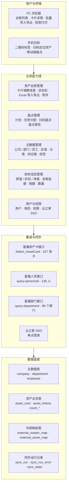
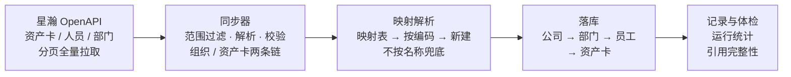

# 固定资产台账管理系统 · 项目介绍

面向集团多法人场景的固定资产台账系统。组织主数据（公司 / 部门 / 员工）与资产卡全部由
星瀚（金蝶）ERP 托管、每日凌晨定时同步；台账侧负责资产卡片的精细化维护、财务信息批量更新、
二维码标签与盘点执行。

| 指标 | 数值 |
|---|---|
| 版本控制文件 | 106 |
| 代码行数 | 18,865（Go 13,419 + Vue 5,446） |
| API 路由 | 65 |
| 数据表 | 20 |
| 前端页面 | 18 |
| 提交 | 29 |

> 更完整的图文版见 [`项目介绍.html`](./项目介绍.html)。

## 业务框架导图

## 星瀚同步链路

每日 00:00 一批：**先同步组织主数据，再同步资产卡**。顺序固定，不可颠倒。

六道护栏：

| 护栏 | 作用 |
|---|---|
| **0 行必须中止** | 源返回 0 行不当「源里没有了」，直接停。否则接口故障会把整张表判成源里没有而清空。 |
| **dry-run 与真跑同口径** | 预估数与实跑数必须一致，否则预检没有意义。 |
| **库名确认闸** | 破坏性操作要求显式确认库名，防止连错库。 |
| **备份须实测可回灌** | 没验证过的备份等于没有备份。 |
| **接口指纹基线对比** | 接口被静默改动的当天就能发现，而不是等业务反馈数据不对。 |
| **引用完整性体检** | 只统计用户可见行；软删除的单独列出，`0` 视为「未设置」而非悬空引用。 |

## 全过程优化点

### 阶段一 · 项目独立化与工程基线

- 从混杂多个项目的工作目录中**独立出来**，建立独立版本控制
- **统一换行符**（`.gitattributes`）——避免 Windows 与 Linux 协作时整文件 diff
- 补充「首次拉取后」初始化步骤，让新成员能照文档跑起来

### 阶段二 · 资产卡字段与编辑权分离

- 新增**数量**字段，补齐卡片信息
- 明确原值 / 累计折旧 / 净值属于**人工维护**范围，不与星瀚托管字段混同
- 修复「同步来的卡在表单里存不了」的既有缺陷
- 确立**托管字段只读、手工字段可填**的规则

> 效果：杜绝了「同步字段被手工改坏、下轮同步又覆盖回去」的反复。

### 阶段三 · 财务信息批量更新

- 新增 **Excel 导入批量更新**财务信息，带**预检**（先算影响面再落库）
- 补上含税金额 / 税额，打通**金额字段全集**
- 步骤提示跟随字段清单自动更新

> 效果：227 张卡的金额回填从「单卡表单点 200 多次」变成一次导入。

### 阶段四 · 财务字段与星瀚对齐（最大的一次攻坚）

- 定位根因：星瀚资产卡接口**取不到原值 / 折旧 / 净值**——这些在星瀚里是**明细子表**数据，
  主表投影里根本没有
- 把「字段取不到」从猜测变成证据：dump 原始 JSON、逐字段统计存在性与非零数
- 按「财务信息是明细数据」**重写接口需求文档**，推动星瀚侧补齐投影列
- 星瀚补齐后接入，**原值 / 累计折旧 / 净值全量对齐**；随后接入含税金额 / 税额
- 勾稽验证：`净值 = 原值 − 累计折旧` 在样本上 200/200 成立，口径可信才落库

> 效果：财务金额从「无法与 ERP 对齐」变成全量一致，且对齐口径有勾稽证明。

### 阶段五 · 把「接口会静默变更」工程化

- 新增**字段指纹对比**（`cmd/kdscan`）：接口投影变更变成一行命令能看见，
  并记录服务端生效的过滤条件
- 新增**逐条核对**（`cmd/kdverify`）：把「验证」从一次性临时脚本变成常驻命令，
  且复用同步器自身的解析规则，避免核对工具自己算错产生假警
- 修正 dry-run 的 affected **重复计数**

> 效果：接口被改动当天就能发现，而不是等业务反馈数据不对。

### 阶段六 · 组织主数据改由星瀚托管

- 接入部门（行政组织）接口，并定位人员接口 0 行的**双重根因**（服务端过滤条件 + 投影变更）
- 部门与人员主数据**整体切换为星瀚托管**，范围固定锁定 `1201` / `1202` 两棵子树
- 范围判定改用**路径前缀**而非编码前缀——编码会跨支
  （`1200151` 挂在 `1201` 下但不以 `1201` 开头）
- 确立**不按名称匹配**：5203 个组织节点只有 1333 个唯一名，「财务部」一个名字挂 78 个节点
- 定时同步改为**每日一批**（先组织、后资产卡），带启动补跑
- 修复「建卡必失败」——`asset_code` 是 NOT NULL 无默认值，INSERT 必须带上

> 效果：部门 / 人员不再需要手工维护；每日 00:00 自动对齐。

### 阶段七 · 生产库组织主数据重建

- 根因：历史遗留的部门 / 员工行是早期「资产卡同步按名称兜底」建出来的，归属与层级残缺
- 新增**五步重建工具**（`cmd/orgreset`）：预检 → 备份 → 清理 → 组织同步 → 资产卡同步，
  中间夹账号重绑，最后打体检报告
- 实测确认**必须连外部映射表一起清**：只删业务表不清映射，同步会拿到已删的 ID 走 UPDATE，
  **影响 0 行且不报错**，表里永远缺行——而同步自报的「更新 96」和正常跑一模一样
- 重建后按**工号**自动重绑登录账号，不按姓名（会重名）
- 体检口径两处修正：**只统计用户可见行**、**`0` 是「未设置」哨兵值**

> 生产执行结果：部门 20 → 88、员工 65 → 136 全部星瀚托管；同名部门塌陷从 10 组归零；
> 可见资产卡 202 张，部门断链 0、使用人断链 0，仅 2 张权属公司待人工指定。

## 关键设计决策

| 决策 | 选择 | 理由 |
|---|---|---|
| 架构成型 | 领域固化，不做元数据驱动 | 参考系统是服务数万租户的低代码平台（表单定义 + 六个规则引擎 + 工作流）。本项目只服务一个集团，那套复杂度不成立。 |
| 主数据来源 | 组织主数据由 ERP 托管 | 手工维护必然与 ERP 漂移，托管后「谁是权威」只有一个答案。 |
| 字段编辑权 | 托管字段只读，手工字段可填 | 避免同步与手工互相覆盖。 |
| 主数据解析 | 映射表 → 按编码 → 新建，**不按名称兜底** | 重名会让两个真实节点认领同一行本地数据，且不报错。 |
| 同步顺序 | 公司 → 部门 → 员工 → 资产卡 | 资产卡要引用部门与人员，顺序反了会落出缺归属的卡。 |
| 异常判据 | 源返回 0 行一律中止 | 接口故障时照常执行会把整张表判成「源里没有了」。 |
| 单据流 | 留到二期 | 先把台账与主数据的准确性做扎实，再叠加流程。 |

## 工程沉淀：五个常驻命令

| 命令 | 职责 |
|---|---|
| `cmd/kdscan` | 分页拉全量、dump 原始 JSON、统计字段存在性与非零数，并与基线指纹对比。回答「接口到底给了什么」。 |
| `cmd/kdverify` | 逐张比对「星瀚接口值」与「台账落库值」。复用同步器的解析规则，保证核对口径与落库口径一致。 |
| `cmd/dryrun` | 只比对不写库，算出本次同步会影响多少张卡。 |
| `cmd/orgsync` | 公司 / 部门 / 员工的同步入口，默认 dry-run。 |
| `cmd/orgreset` | 五步破坏性重建工具，带预检、可回灌备份、库名确认三道护栏。 |

## 待推进事项

**需星瀚侧配合**：修正人员接口服务端过滤条件；补齐 `orgstructure_name` / `orgstructure_number`；
增加人员「主职」标志；清理 `entryentity` 的重复明细。

**需人工确认**：2 张资产卡的权属公司指向本地自建的「SJ 某电器公司」，星瀚侧没有对应公司，
工具不猜归属（挂错公司比断链严重）。

**二期规划**：单据流（入库单、领用退库、调拨、折旧计提）；`finaccountdate` 接入台账「入账时间」。
